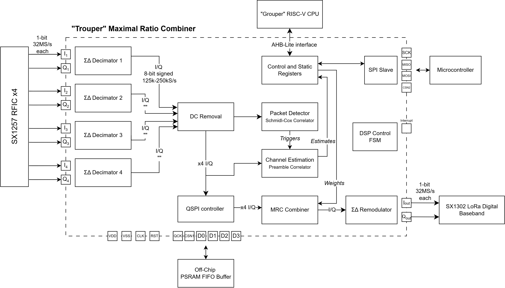

# Trouper
## DSP Hardware implementation of MRC for LoRa standard

This project aims to implement Maximal Ratio Combining, a form of MIMO, by combining baseband data streams from 4 uncorrelated LoRa receivers and weighting according to SNR in order to output a single data stream with a theoretical 6dB improvement in SNR to the digital demodulator.

The application would be for indoor LoRa gateways in order to improve resilience and further reduce the transmit power of low-energy LoRa nodes such as IoT sensors for the power saving benefit.

Designed to work with Grouper SOC #99 for additional software features or as a standalone block.



## Repository Layout

```
src/                    Synthesisable RTL, one directory per functional block (source of truth)
  top/                  trouper_top.v — top-level integration
  decimator/            sd_decimator_poly.v — ΣΔ half-band decimator chain
  frontend/             dc_removal.v, sc_detector.v
  combiner/             training_acc.v, mrc_combiner.v
  remod/                sd_remod.v — ΣΔ re-modulator
  control/              packet_ctrl_fsm.v, reg_bank.v, spi_slave.v, psram_buf_ctrl.v
  config/                LibreLane config for the top-level build (trouper_top.json, SDC, PDN, io placement)
rtl-test/               Verilog RTL + OpenLane/LibreLane P&R configs (legacy/block-level work)
  rtl/                  RTL source files (synthesisable)
  tb/                   Simulation testbenches (tb_*.v)
  scripts/              Run scripts for P&R and simulation jobs
  ol_mimo_rx_top/       Top-level P&R (config_current.json is the active config)
  ol_picorv32*/         PicoRV32 core and wrapper P&R configs (several variants)
sim/                    Python behavioral models and tests
  models/               Bit-true DSP component models (fixed.py, decimator.py, receiver.py, …)
  tests/                pytest-compatible tests + debug scripts
  sims/                 Sweep scripts (BER, SQNR, MIMO)
  notebooks/            Jupyter analysis notebooks
cocotb/                 cocotb functional verification testbenches for src/top/trouper_top.v
fpga-emul/              Arty A7-100T FPGA emulation wrapper (Verilator + Vivado targets)
firmware/               PicoRV32 firmware (register map driver, main.c, linker/crt0)
gnu-radio/              GNU Radio flowgraphs/scripts for ΣΔ modelling and comparison
lora-capture/           Tooling for capturing labelled LoRa IQ datasets (SF/BW/preamble sweeps)
formal/                 SymbiYosys formal verification setups (e.g. psram_buf_ctrl)
planning/               Design documents (System Architecture.md is the canonical reference)
docs/                   System and integration guide
reports/                Diagrams and integration reports (e.g. Grouper/Trouper interface)
pd/                     Archived physical-design bundles (tarballs)
resources/              Datasheets (SX1257, SX1302, APS6404L PSRAM)
ip/                     Third-party IPs (picorv32, AS/OCD SRAM macros, gf180mcu_as_sc_mcu7t3v3)
```

Block-level P&R directories have been removed — synthesis is now hierarchical at the top level (`ol_mimo_rx_top`). Run outputs (`rtl-test/ol_*/runs/`) live on NFS and are referenced via symlinks; they are git-ignored.