```mermaid
gantt
    title Trouper ASIC — Tapeout Schedule
    dateFormat  YYYY-MM-DD
    axisFormat  %d %b
    todayMarker on

    section Milestones
    Team / repo kickoff                    :milestone, m0, 2026-05-09, 0d
    trouper_top (CPU-less) rewrite begins  :milestone, m0b, 2026-06-11, 0d
    src/ + cocotb/ canonical layout landed :milestone, m0d, 2026-07-05, 0d
    RTL / DSP chain functionally complete :milestone, m1, 2026-07-12, 0d
    Formal proofs (PSRAM/pcfsm) closed     :milestone, m2, 2026-07-24, 0d
    SS-corner waived via voltage increase  :milestone, m3, 2026-07-28, 0d
    Final signoff P&R clean (DRC/LVS/SS)   :crit, milestone, m4, 2026-08-21, 0d
    GDS freeze / Chipathon submission      :crit, milestone, m5, 2026-09-01, 0d

    section RTL — Overall
    PicoRV32 + HW weight_gen era (superseded) :done, rh2, 2026-05-22, 2026-06-06
    trouper_top refactor (CPU/SRAM removed)   :done, rh3, 2026-06-06, 2026-06-21
    RTL churn (bug fixes, dead-code removal)   :done, rh7, 2026-07-05, 2026-07-26

    section RTL — Decimator
    Decimator development (spec, R=256->R=32 experiments, HB production, docs) :done, rd0, 2026-05-15, 2026-07-16
    CIC comb pipelined over 5 stages (SS timing)      :milestone, done, rd2, 2026-06-13, 0d
    Half-band migration to production (R=64, CIC-16+HB1+HB2, polyphase/CIC-fold area cut) :milestone, done, rd3, 2026-06-21, 0d
    HB1/HB2 primers + coefficient derivation docs      :milestone, done, rd5, 2026-07-16, 0d

    section RTL — Front-end (dc_removal / sc_detector)
    Front-end development (spec, droop EQ, sweep, B1 area cut, fixes) :done, rf0, 2026-05-15, 2026-07-12
    Droop EQ + sc_detector noise guard     :milestone, done, rf2, 2026-06-19, 0d
    SF7-SF12 x BW250/125 cocotb sweep + sc_thr fix :milestone, done, rf3, 2026-06-21, 0d
    sc_detector B1 area cut - signed_mul24_pipe to bit-serial mul (-17K, no SS regression) :milestone, done, rf4, 2026-07-04, 0d
    sample_count double-count + status-readback fixes :milestone, done, rf5, 2026-07-06, 0d

    section RTL — Combiner (training_acc / mrc_combiner)
    Combiner development (cross-corr switch, all-pairs tacc, B2/B4 area cuts) :done, rc0, 2026-05-15, 2026-07-19
    All-pairs training accumulator + fw eigenvector path :milestone, done, rc2, 2026-06-08, 0d
    mrc_combiner output shift fix + weight quantisation analysis :milestone, done, rc3, 2026-06-13, 0d
    Resetless-Zdiag / dead training_acc reset removal (B2) :milestone, done, rc4, 2026-07-06, 0d
    B4 mrc W-shadow write-lock hardening (-14.1K)  :milestone, done, rc5, 2026-07-19, 0d

    section RTL — Remod & Control Plane
    Remod + control-plane development (CIFF rewrite, JTAG removal, pcfsm/psram work) :done, rr0, 2026-05-24, 2026-07-26
    CIFF remod rewrite                     :milestone, done, rr1, 2026-06-19, 0d
    JTAG removed, PSRAM/IRQ pads dedicated :milestone, done, rr3, 2026-06-13, 0d
    psram_buf_ctrl debug bus + no-skip/re-arm guard :milestone, done, rr4, 2026-06-14, 0d
    Gate 10 sweep - reject 2nd-order remod area cut :milestone, done, rr2, 2026-07-06, 0d
    SPI slave CDC/timing regression suite (#38 groundwork) :milestone, done, rr5, 2026-07-12, 0d
    B6 pcfsm relative-timeout + fanout-split (SS)  :milestone, done, rr6, 2026-07-19, 0d
    buf_freeze dead-code removal            :milestone, done, rr7, 2026-07-26, 0d

    section Physical Design — Area Reduction
    Area-reduction effort (roadmap opened -> B1-B12 levers -> latest refresh) :done, pda0, 2026-06-29, 2026-07-28
    Fixed-pin 1200x1100 signoff standard set :milestone, done, pda1, 2026-07-05, 0d
    B1-B12 lever ranking + measurement complete (sc_det/mrc/pcfsm candidates) :milestone, done, pda3, 2026-07-18, 0d
    B4+B6 measured + merged to main (-17.3K placed, WNS -14.91 best-of-era) :milestone, done, pda4, 2026-07-19, 0d
    minff signoff config congests GRT at 88% density (#41, still open) :milestone, done, pda5, 2026-07-18, 0d
    Area breakdown refreshed (935K, job 3683)  :milestone, done, pda6, 2026-07-28, 0d

    section Physical Design — SS Timing & Signoff (critical path)
    SS-timing closure effort (LibreLane tuning -> item-39/RCX/fanout-split work) :done, pdh0, 2026-05-22, 2026-07-18
    FD-cell area/gate-count baseline        :milestone, done, pdh2, 2026-06-06, 0d
    pd/ bundle archived (rev 2)             :milestone, done, pdh4, 2026-06-19, 0d
    SS-corner waived (voltage increase, 3.0V ss no longer the signoff gate) :done, milestone, pd1, 2026-07-28, 0d
    Split-rail / higher-voltage-core implementation :crit, pd2b, 2026-07-28, 10d
    Hold-corner (min_ff) routing fix (#41) :pd3, 2026-07-28, 10d
    Final signoff P&R (target floorplan)   :crit, pd4, after pd2b, 7d
    RCX parasitic extraction + re-STA      :crit, pd5, after pd4, 3d
    Magic DRC / LVS full-chip signoff      :crit, pd6, after pd5, 3d
    GDS assembly + submission package      :crit, pd7, after pd6, 4d
    Contingency / signoff buffer           :crit, pd8, after pd7, 3d

    section Verification (ongoing)
    Formal harness rewrite + first proofs (PSRAM/pcfsm) :done, vfh1, 2026-07-20, 2026-07-24
    Top-level cocotb regression (SF/BW sweep, ongoing) :active, vf0, 2026-07-05, 2026-08-15
    packet_ctrl_fsm directed coverage (#42):vf1, 2026-07-28, 10d
    Grouper AHB-Lite CDC fix + reverify (#29):vf2, 2026-07-28, 12d
    Host SPI 10 MHz SDC closure (#38)      :vf3, 2026-07-28, 7d
    Regression re-run on final signoff netlist :vf4, after pd4, 3d

    section Firmware / Host
    Firmware development (PicoRV32 skeleton -> Grouper RV32EMC -> noise-weighted MRC) :done, fw00, 2026-06-11, 2026-07-26
    Retarget to Grouper RV32EMC + eigvec timing :milestone, done, fw1a, 2026-07-12, 0d
    Noise-weighted MRC firmware (sigma2 EMA)    :milestone, done, fw1b, 2026-07-26, 0d
    RPi host driver + ChirpStack demo      :fw2, 2026-07-28, 14d
    AGC calibration bench characterization :fw3, 2026-07-28, 21d

    section RF / Hardware
    PCB integration + review effort (verification note -> layout fixes) :done, hw00, 2026-06-06, 2026-07-26
    FPGA BD re-pinned to MISO front-end PCB   :milestone, done, hw0b, 2026-07-09, 0d
    Schematic re-review finds ERC/DRC issues  :milestone, done, hw0c, 2026-07-12, 0d
    Test PCB sent for manufacturing        :done, milestone, hw1, 2026-07-28, 0d
    Test PCB fab + assembly (arrives ~4 Aug):crit, hw2, 2026-07-28, 7d
    PCB bring-up + AFE coherence check     :hw3, after hw2, 10d

    section FPGA Emulation
    FPGA emulation bring-up (Vivado -> trouper_top rework) :done, fp00, 2026-06-07, 2026-07-20
    Ethernet on real hardware (ping OK)       :milestone, done, fp0b, 2026-06-15, 0d
    Rework to instantiate trouper_top.v directly :milestone, done, fp0c, 2026-07-06, 0d
    MIMO / MRC benchmark validation        :milestone, done, fp1, 2026-07-12, 0d
    Final RTL-vs-FPGA regression (post signoff RTL freeze) :fp2, after pd1, 10d
```

# Project Schedule

Tapeout deadline: **1 September 2026**. Today: **28 July 2026**.

Architecture is `trouper_top` — CPU-less, hardware-`weight_gen`-less, fixed
R=64 half-band decimator chain (see `CLAUDE.md` / `planning/System
Architecture.md`). RTL is essentially complete; top-level verification
(cocotb regression, remaining directed coverage) is still ongoing, and the
schedule from here is dominated by one blocking physical-design item
(SS-corner timing closure, Open Risk #1) plus a handful of High-priority
closures that don't block signoff mechanically but should land before GDS
freeze. There is no separate "Chipathon 2026.md" phase-definition doc (the
old link was stale); phases below are defined inline against `planning/Open
Risks.md`.

**Progress-to-date below is grounded in actual `git log` dates**, not
planning-doc snapshots — commit activity ran 3-48/week with a lull 30 May–5
Jun (1 commit, between the PicoRV32/weight_gen era and the `trouper_top`
rewrite) and a gap 27–28 Jun (just after the half-band decimator migration
landed). Only the forward-looking sections (from 28 Jul onward) are
estimates.

---

---

## Critical path

The chain that determines whether September 1 is achievable — everything
else in the schedule has float against it:

1. **SS-corner decision: waived via voltage increase** (Open Risk #1,
   decided 2026-07-28) — the `gf180mcu_fd_sc_mcu7t5v0` FD library fails
   32 MHz SS timing at 3.0 V (WNS in the −12 to −25 ns band across recent
   runs), but the *same routed netlist* meets timing outright at 4.5 V with
   zero re-optimization. Rather than chase the `u_psram` QSPI pipeline fix
   (blocked on DRT-1231/DRT-0073 routing failures on every floorplan tried),
   the project is **raising the core voltage instead of holding 3.0 V SS as
   the signoff gate**. What's left is implementation, not decision: the
   split-rail / higher-voltage-core supply work (Open Risk #27 — split-rail
   IO down-level-shift characterization) and re-running signoff P&R
   targeting the new corner.
2. **Final signoff P&R** — re-run (or re-target) place & route at the
   higher-voltage corner, carrying forward the current 1200×1100 µm / 88%
   density baseline unless the voltage/IO work forces a floorplan change.
3. **RCX + full-chip DRC/LVS signoff** — no float; this is the last gate
   before GDS.
4. **GDS assembly + Chipathon submission package** — mechanical once P&R is
   clean, but still needs buffer for a failed DRC/LVS pass to be re-run.

Everything else (packet_ctrl_fsm directed coverage, Grouper AHB-Lite CDC,
host SPI SDC, AGC bench characterization, PCB bring-up) runs in parallel and
has real float — none of it blocks GDS freeze mechanically, but High-priority
items (#29, #38, #42) should close before submission so they don't become
silent post-tapeout risk.

---

## Float / risk

| Risk | Float | Mitigation |
| --- | --- | --- |
| Split-rail / higher-voltage-core supply work runs long | 5 days | Decision is made (waive 3.0V SS, raise core voltage) — remaining risk is IO-level characterization (Open Risk #27), not re-litigating the decision; analysis is in `planning/5v-core-voltage-strategy.md` |
| DRT-1231 CTS pin-access recurs on the post-decision floorplan (#6) | 3 days | Fix is confirmed timing-SDC-sensitive, not floorplan-general; re-validate against whichever SDC the final decision produces before trusting prior fixes |
| Hold-corner (`min_ff`) RCX fix congests GRT at signoff density (#41) | 5 days | Currently unusable at 88% density; may need to fall back to the plain `max_ff` corner set used in recent signoff runs |
| Grouper AHB-Lite bus has no CDC (#29) | 5 days | Confirm same-clock assumption holds for the actual Grouper integration, or add synchronizers before submission |
| MISO front-end test PCB fab/assembly slips past ~4 Aug arrival | 10 days | PCB bring-up is off the tapeout critical path but needed for pre-silicon AFE validation; board is already at the manufacturer, so this is a shipping/assembly risk, not a design risk |
| AGC unverified on real silicon (#8) | — (post-tapeout) | No bench coverage possible before tapeout; document as a known deployment-time risk, not a blocker |
| Chipathon shuttle deadline shifts | — | Monitor SSCS announcements |

---

## Progress to date (grounded in `git log`)

- **RTL — overall**: started as sim/golden-reference work (2026-05-09),
  moved through a PicoRV32 + hardware-`weight_gen` architecture (through
  2026-06-06), then the `trouper_top` rewrite dropped the on-chip CPU/SRAM
  (2026-06-06 → 2026-06-21). Canonical `src/` + `cocotb/` layout landed
  2026-07-05; RTL kept churning (bug fixes, dead-code removal) through
  2026-07-26. Per-block detail (decimator, front-end, combiner, remod/
  control) is broken out in the mermaid chart above rather than lumped
  together — there was real experimentation and rework within each block,
  not just one linear pass.
- **Decimator**: biggest single rewrite in the project. Ran R=256 → R=32
  ratio experiments early (2026-05-15 → 05-17), pipelined the CIC comb over
  5 stages for SS timing (2026-06-13), then migrated to the production
  half-band chain (`sd_decimator_cic_tdm8` → `sd_decimator_poly`, R=64,
  CIC-16 + HB1 + HB2, with a polyphase/CIC-fold area cut baked into the same
  migration) 2026-06-19 → 06-21, cleaned up the migration sandbox through
  06-30, and added HB1/HB2 coefficient-derivation docs 2026-07-16.
- **Front-end (dc_removal / sc_detector)**: droop EQ + noise guard
  2026-06-19, SF7-SF12 × BW250/125 cocotb sweep 2026-06-20/21, then a
  targeted area cut (B1: `signed_mul24_pipe` → bit-serial multiplier, −17K
  µm², no SS regression) 2026-07-04, and a `sample_count` double-count fix
  2026-07-06.
- **Combiner (training_acc / mrc_combiner)**: cross-correlation architecture
  switch 2026-05-15/16, all-pairs training accumulator + firmware
  eigenvector path 2026-06-08, output-shift + weight-quantisation fix
  2026-06-13, resetless-Zdiag area cut (B2) 2026-07-06, and the B4 W-shadow
  write-lock hardening 2026-07-19.
- **Remod & control plane**: CIFF remod rewrite 2026-06-19 (a 2nd-order
  area cut was evaluated and rejected 2026-07-06 — SQNR risk not worth the
  area); JTAG removed and pads dedicated to PSRAM/IRQ 2026-06-13; PSRAM
  debug bus + no-skip/re-arm guard 2026-06-13/14; SPI CDC regression suite
  groundwork 2026-07-12; B6 pcfsm relative-timeout + fanout-split for SS
  2026-07-18/19.
- **Physical design — area reduction**: ran as its own effort alongside SS
  closure, documented in `planning/area-reduction-roadmap.md` (opened
  2026-06-29). Fixed-pin 1200×1100 signoff standard set 2026-07-05; B1–B12
  levers ranked and measured 2026-07-04 → 07-18; B4+B6 merged to main
  (−17.3K placed, SS WNS −14.91 best-of-era) 2026-07-18/19; found the
  `min_ff` hold-corner config congests GRT at 88% density (Open Risk #41,
  still open) 2026-07-18; area breakdown refreshed to 935K µm² 2026-07-28.
- **Physical design — SS timing & signoff**: LibreLane tuning and first
  P&R runs from 2026-05-22; FD-cell area baselines from 2026-06-06; `pd/`
  bundle archived 2026-06-19; item-39 write-arc fix, RCX ruleset fix, and
  fanout-split experiments ran 2026-07-12 → 07-18 chasing an honest RTL fix.
  The chip-wide SS gap (Open Risk #1) is now **waived, not closed**: rather
  than land the blocked `u_psram` QSPI pipeline fix, the project is raising
  the core voltage instead of holding 3.0 V SS as the signoff gate (decided
  2026-07-28) — see Critical Path above.
- **Formal verification**: harness rewrite + first `psram_buf_ctrl` and
  `packet_ctrl_fsm` k-induction proofs 2026-07-20, expanded through directed
  replay-FSM tests 2026-07-24 — these formal proofs are closed, but
  top-level cocotb regression (SF/BW sweep) and the directed-coverage gaps
  (#42) are still open and ongoing, not finished.
- **FPGA emulation**: Vivado/Arty A7-100T bring-up and UART debug tooling
  2026-06-07 → 2026-06-15 (Ethernet-on-hardware working 2026-06-15); reworked
  to instantiate `trouper_top.v` directly and re-pinned to the MISO
  front-end test PCB 2026-07-06 → 2026-07-09; MIMO/MRC benchmark validated
  2026-07-12. Last touch 2026-07-20 (schematic review notes, docs only).
- **PCB / RF hardware**: the board itself lives in an external repo
  (`gitlab.com/m0rtal/miso_frontend`) — only integration/review notes are
  tracked here. First touchpoint 2026-06-06 (SX1257 I/Q-tied-to-GND
  verification note); FPGA re-pinned to the board 2026-07-08/09; schematic
  re-review 2026-07-12 found ERC/DRC violations, since fixed — **the board
  has now been sent for manufacturing and is expected to arrive ~4 August**.
- **Firmware**: PicoRV32 bare-metal skeleton (2026-06-11) was superseded
  when the on-chip CPU was dropped; retargeted to the **Grouper RV32EMC**
  core 2026-07-12 (register-map resync, eigvec timing measured); a
  noise-weighted MRC firmware update (sigma2 EMA + SNR-weighted eigenvector)
  landed and was regressed as late as 2026-07-26 — firmware work is more
  recent and more substantial than a single "done in June" bar would show.
- PSRAM continuous-delay replay redesign merged, closing the silent-buffering
  ΣΔ tone bug (Open Risk #5, fixed 2026-07-12).
