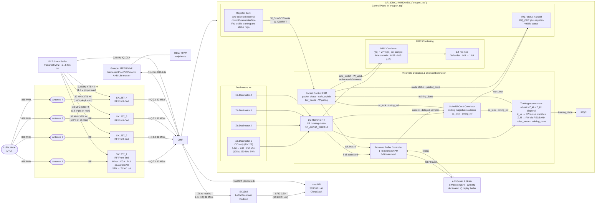

# System Architecture & Block Overview

> Architecture — NT=1 NR=4 MRC single-mode MIMO gateway ASIC.
> GF180MCU. 3.3 V core and IO. SSCS PICO Chipathon 2026. Tapeout deadline: September 2026.
> Supported LoRa BW: **125 kHz and 250 kHz only** (both use decim_ratio=1, R=128). 500 kHz BW not supported (CIC-only SQNR 9.6 dB at R=64).

Related prototype hardware note: [AFE Characterisation Board](AFE%20Characterisation%20Board.md)

Full pad list: [Pinout](Pinout.md)

Deployment configurations: [Applications](Applications.md)


RTL integration note: `trouper_top` is the canonical standalone Trouper
hard-macro RTL. `mimo_rx_top` is deprecated and retained only as a legacy
compatibility wrapper for archived synthesis/P&R comparisons. New work should
not target `mimo_rx_top`. Grouper and any host SPI/AHB adaptation now sit
outside this hardened Trouper boundary.

---

## Architecture: NR=4 single-chip

The system implements **NR=4 MRC combining gain** (~6 dB diversity gain over single-antenna) on a single ASIC. Four SX1257 front-ends feed four ΣΔ decimator branches directly into the ASIC:

```
SX1257_1 ──► ASIC (NR=4) ──► SX1302 Radio A
SX1257_2 ──►
SX1257_3 ──►
SX1257_4 ──►
```

## System Architecture

The system consists of two separate hardened projects on the same MPW: **Trouper** (radio datapath macro) and **Grouper** (system-control macro).

- **Grouper Project:** Contains the hardened **PicoRV32 RV32IM** controller macro and any broader system-bus fabric.
- **Trouper Project:** Contains only the radio datapath, local register bank, PSRAM replay path, and status/IRQ handoff signals required by the future top-level integration. Host SPI and Grouper bus adaptation are outside the standalone Trouper macro boundary.



---

## Interfaces

| Interface | From | To | Signal | Rate |
| --- | --- | --- | --- | --- |
| RX I/Q ×4 | SX1257_1–4 ΣΔ ADC | ASIC decimators | 1-bit I+Q sigma-delta | 32 MS/s per antenna |
| RX CLK | PCB Clock Buffer | ASIC (shared) | 32 MHz clock | — |
| AFE control / config | External board or companion-system logic | SX1257_1–4 | Reset, mode, frequency, gain programming outside Trouper RTL | board-defined |
| ΣΔ re-mod A | ASIC | SX1302 Radio A | 1-bit I+Q sigma-delta | 32 MS/s |
| PSRAM QSPI | Trouper `psram_buf_ctrl` or a future firmware-managed external-memory mode | APS6404L (ext.) | replay buffer or firmware-managed off-chip RAM | 32 MHz QPI |
| Host SPI | RPi SPI0 CS1 | Trouper SPI slave | Dedicated host register access and debug | 10 MHz |
| SX1302 SPI | RPi SPI0 CS0 | SX1302 | SX1302 HAL (packets, config) | 10 MHz |
| AHB-Lite | Grouper (Bus Master) | Trouper (Slave) + Other Peripherals | MPW System Bus | 32 MHz |
| IRQ | Trouper (ASIC) | Grouper (PicoRV32) | Packet ready, error | Interrupt |

### SX1257 → ASIC (RX, per antenna)

| Signal | Direction | Description |
| --- | --- | --- |
| `IQ_DATA_I[n]` | SX1257_n → ASIC | 1-bit RX I sigma-delta stream |
| `IQ_DATA_Q[n]` | SX1257_n → ASIC | 1-bit RX Q sigma-delta stream |
| `IQ_CLK` | PCB Buffer → ASIC | 32 MHz shared clock from central TCXO buffer |

### ASIC → SX1302 (ΣΔ re-mod output)

| Signal | Direction | Description |
| --- | --- | --- |
| `REMOD_A_I` / `REMOD_A_Q` | ASIC → SX1302 Radio A | MRC combined stream |

> **SX1302 clock:** SX1302 CLK_IN is driven by SX1257_1 CLK_OUT (pin 10) directly on the PCB — no ASIC pad required. Per §3.5.2 SX1257 CLK_OUT outputs the buffered XTB reference (32 MHz); SX1257_2–4 CLK_OUT left NC.

### Host SPI interface to `trouper_top`

| Signal | Description |
| --- | --- |
| `SPI_MOSI` | Host-driven register writes and debug commands into the ASIC SPI slave |
| `SPI_MISO` | ASIC status/config readback from the SPI slave |
| `SPI_SCK` | Host-driven SPI clock for host↔ASIC register access |
| `HOST_CS` | RPi SPI0 CS1 → ASIC chip select |


### SX1257 board-level pin dispositions (not ASIC pads)

The following SX1257 pins require a PCB-level decision; none connect to ASIC pads.

| SX1257 pin | All 4 devices | Notes |
| --- | --- | --- |
| RESET (pin 9) | Leave floating during POR; connect to RPi GPIO for optional manual reset | Must float during POR sequence (§6.2.1). Pull to GND via 100 nF cap to filter transients. If RPi GPIO used: drive high >100 µs, release, wait 5 ms before SPI access. **Decision needed: floating-only or RPi-controlled?** |
| XTA (pin 6) | All 4 devices: leave open (float) | When using XTB as TCXO/external clock input (§3.3.1), XTA must be left open. |
| XTB (pin 8) | All 4 devices: receive 32 MHz from central clock buffer via 100 pF AC-cap | **CRITICAL ELECTRICAL LIMIT:** Max amplitude **1.8 V pk-pk** (§3.3.1). If central buffer is 3.3V, a voltage divider or 1.8V buffer is mandatory. This pin is the reference for both RX and TX PLLs, ensuring system-wide frequency alignment. |
| CLK_IN (pin 11) | All 4 devices: leave NC | **Design Decision:** Using internal clock mode (§3.5.2) to save ASIC pads. Frequency lock is maintained via shared XTB reference. |
| CLK_OUT (pin 10) | SX1257_1: CLK_OUT → SX1302 CLK_IN (PCB trace). SX1257_2–4: leave NC | SX1257_1 CLK_OUT provides the 32 MHz clock for SX1302 data sync (§3.5.2). No ASIC pad required. |

> SX1257 electrical constraints (XTB voltage limit, LDO decoupling, I_IN/Q_IN pull-downs, DIO NC disposition) are documented in [Pinout](Pinout.md).

### RPi → ASIC (host register access + debug)

| Signal | Direction | Description |
| --- | --- | --- |
| `HOST_CS` | RPi → ASIC | SPI0 CS1 — active low |
| `SPI_SCK` | RPi → ASIC | Shared SPI clock |
| `SPI_MOSI` | RPi → ASIC | Register writes and debug commands |
| `SPI_MISO` | ASIC → RPi | Status register readback |
| `IRQ_OUT` | ASIC → RPi | Interrupt: packet ready, preamble lock (dedicated pad) |

### Grouper-Inactive / Host-Assisted Operation

Trouper remains usable when the Grouper firmware path is inactive. In that mode:

- the RX datapath still runs: decimation, DC removal, SC detection, training accumulation, combining, and ΣΔ re-modulation remain active
- no weight commits occur unless an external host writes `W_SHADOW` and pulses `W_COMMIT` over the host SPI path
- AFE configuration remains external to Trouper; the ASIC does not originate SX1257 transactions in this revision

An optional host-assisted mode may compute `W` off chip and apply it through the existing `W_SHADOW` / `W_COMMIT` path over SPI. Same-packet use of host-computed weights for the full packet requires `PSRAM_EN=1` so the packet can be replayed from its stored start; without PSRAM replay, the host path is a next-packet or payload-only refinement rather than a full-packet live replacement.

---


## Fidelity and Stability Concerns

The RX signal path relies on precise scaling and saturation logic to maintain signal integrity from the antenna to the radio output. The following constraints are binding for design and verification:

| Pressure Point | Stage | Risk | Mitigation/Verification Requirement |
| --- | --- | --- | --- |
| **CIC Droop** | Stage 2 | −7.3 dB band-edge roll-off at 0.4×Nyquist | CIC-only (no FIR). At R=128, SQNR = 30.6 dB — adequate because (a) SX1257 analog IF filter limits alias energy, (b) sd_remod→SX1302 provides additional filtering, (c) LoRa CSS processing gain absorbs residual noise. 500 kHz BW excluded from spec. |
| **Combiner Truncation** | Stage 8 | Signal clipping or quantization noise | Combiner outputs int8 (MRC: int32 ÷2 → int8; bypass: direct int8). AGC must keep per-branch amplitude ≤ −3 dBFS (≤ 90 counts int8) so combined output stays within int8 range after ÷2. Int8 saturation is a safety net only. |
| **Re-modulator Stability** | Stage 9 | Integrator latch-up / Instability | Input must be strictly `< -3 dBFS`. Saturating adders are mandatory; wrap-around will cause permanent instability. |

> **End-to-End Verification Requirement:** A 'bit-exactness' check is required. The RTL implementation must be validated against a high-precision Python reference model using test vectors across the full input dynamic range to ensure error-signal SNR reflects only LSB quantization and no correlated clipping artifacts.

| Group | Pads | Notes |
| --- | --- | --- |
| SX1257 DATA_I ×4 | 4 | |
| SX1257 DATA_Q ×4 | 4 | |
| IQ_CLK | 1 | ASIC core clock = TCXO buffer output; same reference driven to SX1257 XTB on PCB |
| SX1302 Radio A I+Q | 2 | ΣΔ re-mod stream (MRC output) |
| SPI MOSI / MISO / SCK | 3 | Host↔ASIC SPI slave interface |
| HOST_CS | 1 | RPi SPI0 CS1 for the Trouper host SPI slave |
| RESETB | 1 | Active-low chip reset |
| PSRAM SCK / CE_N | 2 | APS6404L serial clock and active-low chip enable |
| IRQ_OUT | 1 | Dedicated level-high interrupt to host RPi |
| PSRAM SIO[3:0] | 4 | PSRAM QPI data bus (dedicated; JTAG/GPIO removed — see [Pinout](Pinout.md)) |
| VDD IO 5.0V | 1 | |
| VDD core 3.3V | 1 | Single pad — IR drop must be verified in floorplan |
| GND | 1 | Single pad — place at highest switching-current region |
| **Total** | **26** | Within the ≤26 per-team allocation limit |

---

## Clock domain crossing boundaries

The design uses two internal clock domains derived from the single 32 MHz external reference (`IQ_CLK`, sourced from the central PCB TCXO buffer — the same reference driven to all four SX1257 XTB pins):

| Domain | Clock | Period | Blocks |
|---|---|---|---|
| 32 MHz tier | `IQ_CLK` | 31.25 ns | `sd_decimator_cic_only` ×4, `sd_remod`, `psram_buf_ctrl`, `sc_detector`, `trouper_top` glue |
| 16 MHz tier | `CLK_16M` (IQ_CLK÷2) | 62.5 ns | `dc_removal`, `training_acc`, `mrc_combiner`, `frontend_buf_ctrl`, `packet_ctrl_fsm`, `reg_bank` (incl. interrupt aggregation), `spi_slave` |

`CLK_16M` is generated **once at top level** as a registered divide-by-2 of IQ_CLK and distributed as a normal clock tree. Per-block local clock dividers are not used. The divider FF is synchronously reset so phase is deterministic after RESETB de-assertion.

Rationale for block placement:

- `sd_decimator_cic_only`, `sd_remod`, and `psram_buf_ctrl` have true 32 MHz bit-level timing obligations.
- `sc_detector` has a TDM FSM with single-cycle path dependencies; moving it to 16 MHz does not eliminate the SS violation (the TDM chain still needs one full cycle, and at 62.5 ns it still exceeds the ~72 ns SS path). Fix requires pipelining the TDM accumulator into 2 cycles.
- All remaining blocks update only on `iq_valid` or `raw_valid` and have no 32 MHz timing obligations; they run comfortably at 62.5 ns.

### Domain crossing treatment

Because CLK_16M is phase-aligned with IQ_CLK (derived by registered divide-by-2), there is no metastability risk at domain crossings. No 2-FF synchronisers are required. The SDC declares CLK_16M as a generated clock and the timing analyser constrains all crossings automatically:

```
create_generated_clock -divide_by 2 -source [get_ports IQ_CLK] \
  [get_pins clk_div_reg/Q] -name CLK_16M
```

> **CFO is a transmitter-only property.** Because all four SX1257 AFEs and the ASIC itself derive their clocks from one TCXO, there is no sampling-rate offset (SRO) between antennas or between the ADC outputs and ASIC processing. Any observed carrier frequency offset `df` is entirely due to the remote transmitter's TCXO offset. The digital CFO correction `exp(−j2π·df_est·n/Fs)` applied in firmware operates with cycle-accurate sample indexing — no accumulated phase error from clock-domain mismatch. The residuals quantified in `sim/notebooks/02_cfo_estimation.ipynb` are therefore the complete error budget.

The following boundaries require explicit treatment:

| Boundary | Signal(s) | Direction | Required treatment | Documented in |
| --- | --- | --- | --- | --- |
| RPi SPI slave | `HOST_CS`, `SPI_SCK`, `SPI_MOSI` | RPi (async) → ASIC | 2-FF synchroniser on `HOST_CS` and `SPI_SCK` edges; or run SPI slave FSM in the SPI clock domain with AHB-Lite handshake | [SPI Slave](blocks/SPI%20Slave.md) |
| IQ_CLK → CLK_16M | `raw_valid`, decimated I/Q samples | 32 MHz → 16 MHz | STA-constrained via `create_generated_clock`; no synchroniser logic required (phase-aligned clocks) | TRPR-SYS-003, TRPR-SYS-016 |
| CLK_16M → IQ_CLK | weight shadow registers, control strobes to `sd_remod`/`psram_buf_ctrl` | 16 MHz → 32 MHz | STA-constrained via `create_generated_clock`; no synchroniser logic required (phase-aligned clocks) | TRPR-SYS-003, TRPR-SYS-015 |

**SX1257 I/Q bitstreams are NOT a CDC boundary.** All four SX1257s receive the 32 MHz reference on their **XTB** pins (sourced from a shared TCXO via a clock buffer), so their `I_OUT`/`Q_OUT` signals change on the falling edge of the same clock the ASIC uses. This is a timing-constraint problem (board-level setup/hold on pad inputs), not a metastability problem. **Note: Using CLK_IN (pin 11) is incorrect as it only feeds the TX DAC.**

**SX1257 DIO pins — not connected.** With 0 spare ASIC pads, DIO0–DIO3 from each SX1257 are not routed to ASIC pads. PLL lock is polled via `RegModeStatus` (0x11) over SPI instead. No CDC treatment required.

---

## Gate count & area summary

**Top-level figures — `RUN_2026-06-06_01-25-43`** (FD cells, flat LibreLane P&R). Note: predates removal of `weight_gen` and `noise_est`; logic area will be updated on next P&R run.

| Metric | Value |
| --- | --- |
| Logic area (excl. SRAMs, flat optimised) | **~431,000 µm²** (stale — `weight_gen` + `noise_est` not yet removed from this run) |
| Frontend buffer SRAM (1 × FD 512×8) | ~209,000 µm² (0.21 mm²) |
| CPU SRAM (4 × OCD 1024×8) | ~838,000 µm² (0.84 mm²) |
| **Total synthesis area (logic + SRAMs)** | **~1,478,000 µm² (1.48 mm²)** (weight_gen excluded from logic) |
| Core area (placed) | 1,822,012 µm² (1.82 mm²) at 69.3% utilisation |
| Post-PNR WNS — TT 25°C 3.3 V (setup) | +24.70 ns ✓ |
| Post-PNR WNS — SS 125°C 3.0 V (setup) | **−10.08 ns ✗** (expected — FD cells fail 32 MHz SS) |
| Post-PNR WNS — FF −40°C 3.6 V (hold) | −0.98 ns ✗ (hold violations at FF corner) |
| Power — TT 25°C 3.3 V | 50.9 mW (42.5 mW internal + 8.4 mW switching) |

**Per-module breakdown — SGE job 1330** (FD cells, hierarchical Yosys synthesis, SRAMs blackboxed). Note: hierarchical synthesis does not optimise across module boundaries so individual areas are conservative estimates; the flat P&R total above is the authoritative number.

| Component | FD-cell µm² | Notes |
| --- | --- | --- |
| ΣΔ Decimator CIC-only ×4 | 71,502 × 4 = **286,008** | per-instance × 4 |
| ~~Weight Generation (`weight_gen.v`)~~ | ~~141,244~~ | **Removed** — weights are firmware-computed |
| Training Accumulator | **132,706** | |
| Schmidl-Cox Detector | **111,942** | incl. `signed_mul24_pipe` shared multiplier |
| Register Bank | **81,703** | stale — 32 registers removed since this run |
| MRC Combiner | **61,738** | |
| PSRAM Buffer Controller | **44,071** | |
| Packet Control FSM | **43,551** | |
| DC Removal | **32,138** | |
| ΣΔ Re-modulator | **28,250** | |
| ~~Noise Estimation (`noise_est`)~~ | ~~22,929** | **Removed** — firmware EMA via ZDIAG readback |
| Frontend Buffer Controller | **22,615** | |
| SPI Slave | **16,420** | |
| Top-level glue (`trouper_top`) | **11,116** | |
| SPI Master | **9,483** | |
| IRQ Controller | **2,402** | |
| AHB-Lite Bus | **2,149** | |
| **PicoRV32 (Grouper Project)** | **Part of Grouper** | Hardened macro in separate project |
| **Logic subtotal (Trouper only)** | **~789,000 µm²** | hierarchical (conservative) |

> CPU memory and PicoRV32 core are now part of the **Grouper** project. Trouper contains only the MIMO RX datapath and its control slaves. FFT engine and baseband SRAM are removed in the non-FFT architecture.

Area-reduction options (SC simplification, NR=2 acquisition, PSRAM-assisted weight timing) are tracked in [area-cut-contingency.md](area-cut-contingency.md).

---

## Operating modes

| Mode | Config | Combining | Output | Notes |
| --- | --- | --- | --- | --- |
| 1 | NT=1, NR=4 | MRC | ΣΔ re-mod → SX1302 Radio A | Default; works with any standard LoRaWAN node |
| 2 | NT=1, NR=1 | Passthrough (bypass) | ΣΔ re-mod → SX1302 Radio A | Stages 4–8 bypassed; single-antenna baseline for SNR/BER comparison |

Mode 2 (passthrough) is selected by writing `MIMO_CTRL.MODE = 1`; antenna is chosen by the lowest set bit of `ANTENNA_EN`.

---

## Block ownership

See [Work Allocation Summary](Work%20Allocation.md) for a more detailed assignment view with subblocks and responsibilities.

| Block | Owner | Spec |
| --- | --- | --- |
| ΣΔ Decimator ×4 (CIC-only, R=128) | TBD | [ΣΔ Decimator](blocks/ΣΔ%20Decimator.md) |
| DC Removal ×4 | TBD | [DC Removal](blocks/DC%20Removal.md) |
| Schmidl-Cox Preamble Detector | TBD | [Correlator Bank](blocks/Correlator%20Bank.md) |
| Frontend Buffer Controller (1 kB SRAM) | TBD | [Frontend Buffer Controller](blocks/Frontend%20Buffer%20Controller.md) |
| PSRAM Buffer Controller (APS6404L, QSPI) | TBD | [Memory Strategy](Memory%20Strategy.md) |
| Training Accumulator | TBD | [Training Accumulator](blocks/Training%20Accumulator.md) |
| Packet Control FSM | TBD | [Packet Control FSM](blocks/Packet%20Control%20FSM.md) |
| MRC Combiner | TBD | [MRC Combiner](blocks/MRC%20Combiner.md) |
| ΣΔ Re-modulator | TBD | [ΣΔ Re-modulator](blocks/ΣΔ%20Re-modulator.md) |
| PicoRV32 RV32IM integration | TBD | [PicoRV32 Integration](blocks/PicoRV32%20Integration.md) |
| PicoRV32 SRAM (4 KB unified, OCD macros) | TBD | [Memory Strategy](Memory%20Strategy.md) |
| SPI Slave (host interface) | TBD | [SPI Slave](blocks/SPI%20Slave.md) |
| SPI Master (→ SX1257) | TBD | [SPI Master](blocks/SPI%20Master.md) |
| AHB-Lite Bus | TBD | — |
| Register Bank (generated) | TBD | [Register Map](Register%20Map.md) |
| Interrupt aggregation (in reg_bank) | TBD | [Interrupt Aggregation](blocks/Interrupt%20Aggregation.md) |
| PicoRV32 firmware + algorithms | TBD | [MIMO Algorithms](MIMO%20Algorithms.md) |
| Physical design & floorplan | TBD | — |
| Verification (cocotb) | TBD | — |
| System simulation and algorithm models (Python/GNU Radio) | TBD | — |

Software and verification deliverables:

- `System simulation and algorithm models` owns the Python-first ladder: behavioral model, algorithm selection, threshold tuning, and fallback policy.
- `Verification (cocotb)` owns RTL-to-Python comparison, packet-level regression, register behavior, and block/integration testbenches.
- `PicoRV32 firmware + algorithms` owns the firmware-side control loop, AGC, W computation, and in-the-loop behavior once the RTL model is stable.
