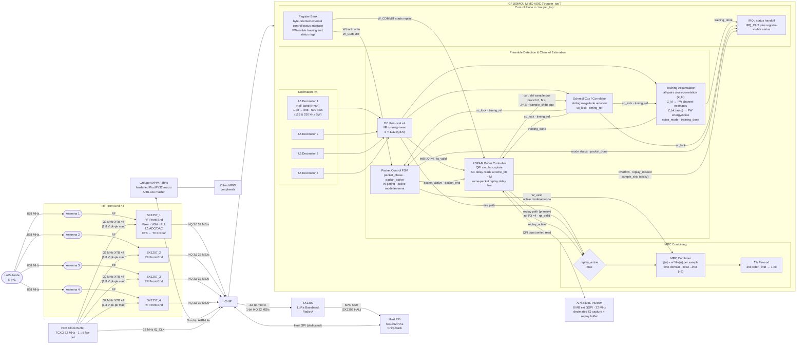

# System Architecture & Block Overview

> Architecture — NT=1 NR=4 MRC single-mode MIMO gateway ASIC.
> GF180MCU. 3.3 V core and IO. SSCS PICO Chipathon 2026. Tapeout deadline: September 2026.
> Supported LoRa BW: **125 kHz and 250 kHz**, fixed R=64 half-band chain at 500 kS/s; `BW_CFG.bw_sel` sets `sample_shift` (not the decimation ratio). 1 MHz out of scope. See `decimator-hb-migration-impact-plan.md`.

Related prototype hardware note: [AFE Characterisation Board](AFE%20Characterisation%20Board.md)

Bring-up / integration procedure: [System and Integration Guide](../docs/System%20and%20Integration%20Guide.md)

Full pad list: [Pinout](Pinout.md)

Deployment configurations: [Applications](Applications.md)


RTL integration note: `trouper_top` is the canonical standalone Trouper
hard-macro RTL. `mimo_rx_top` is deprecated and retained only as a legacy
compatibility wrapper for archived synthesis/P&R comparisons. New work should
not target `mimo_rx_top`. Grouper and any host SPI/AHB adaptation now sit
outside this hardened Trouper boundary.

---

## Architecture: NR=4 single-chip

The system implements **NR=4 MRC combining gain** (~6 dB diversity gain over single-antenna) on a single ASIC. Four SX1257 front-ends feed four ΣΔ decimator branches directly into the ASIC:

```
SX1257_1 ──► ASIC (NR=4) ──► SX1302 Radio A
SX1257_2 ──►
SX1257_3 ──►
SX1257_4 ──►
```

## System Architecture

The system consists of two separate hardened projects on the same MPW: **Trouper** (radio datapath macro) and **Grouper** (system-control macro).

> **Update 2026-09-01: Grouper is not taping out.** Trouper's inter-project
> boundary to it — the `GRP_*` register bus, the AHB-Lite `H*` endpoint and
> `IRQ_GROUPER` — has been removed from `src/top/trouper_top.v`. Trouper now
> tapes out as a fully standalone macro whose only control path is the host SPI
> slave. Grouper-facing statements in the rest of this document are historical.

- **Grouper Project:** Contains the hardened **PicoRV32 RV32IM** controller macro and any broader system-bus fabric.
- **Trouper Project:** Contains only the radio datapath, local register bank, PSRAM replay path, and status/IRQ handoff signals required by the future top-level integration. Host SPI and Grouper bus adaptation are outside the standalone Trouper macro boundary.



---

## Interfaces

| Interface | From | To | Signal | Rate |
| --- | --- | --- | --- | --- |
| RX I/Q ×4 | SX1257_1–4 ΣΔ ADC | ASIC decimators | 1-bit I+Q sigma-delta | 32 MS/s per antenna |
| RX CLK | PCB Clock Buffer | ASIC (shared) | 32 MHz clock | — |
| AFE control / config | External board or companion-system logic | SX1257_1–4 | Reset, mode, frequency, gain programming outside Trouper RTL | board-defined |
| ΣΔ re-mod A | ASIC | SX1302 Radio A | 1-bit I+Q sigma-delta | 32 MS/s |
| PSRAM QSPI | Trouper `psram_buf_ctrl` or a future firmware-managed external-memory mode | APS6404L (ext.) | replay buffer or firmware-managed off-chip RAM | 32 MHz QPI |
| Host SPI | RPi SPI0 CS1 | Trouper SPI slave | Dedicated host register access and debug | 2 MHz |
| SX1302 SPI | RPi SPI0 CS0 | SX1302 | SX1302 HAL (packets, config) | 10 MHz |

### SX1257 → ASIC (RX, per antenna)

| Signal | Direction | Description |
| --- | --- | --- |
| `IQ_DATA_I[n]` | SX1257_n → ASIC | 1-bit RX I sigma-delta stream |
| `IQ_DATA_Q[n]` | SX1257_n → ASIC | 1-bit RX Q sigma-delta stream |
| `IQ_CLK` | PCB Buffer → ASIC | 32 MHz shared clock from central TCXO buffer |

### ASIC → SX1302 (ΣΔ re-mod output)

| Signal | Direction | Description |
| --- | --- | --- |
| `REMOD_A_I` / `REMOD_A_Q` | ASIC → SX1302 Radio A | MRC combined stream |

> **SX1302 clock:** SX1302 CLK_IN is driven by SX1257_1 CLK_OUT (pin 10) directly on the PCB — no ASIC pad required. Per §3.5.2 SX1257 CLK_OUT outputs the buffered XTB reference (32 MHz); SX1257_2–4 CLK_OUT left NC.

### Host SPI interface to `trouper_top`

| Signal | Description |
| --- | --- |
| `SPI_MOSI` | Host-driven register writes and debug commands into the ASIC SPI slave |
| `SPI_MISO` | ASIC status/config readback from the SPI slave |
| `SPI_SCK` | Host-driven SPI clock for host↔ASIC register access |
| `HOST_CS` | RPi SPI0 CS1 → ASIC chip select |


### SX1257 board-level pin dispositions (not ASIC pads)

The following SX1257 pins require a PCB-level decision; none connect to ASIC pads.

| SX1257 pin | All 4 devices | Notes |
| --- | --- | --- |
| RESET (pin 9) | Leave floating during POR; connect to RPi GPIO for optional manual reset | Must float during POR sequence (§6.2.1). Pull to GND via 100 nF cap to filter transients. If RPi GPIO used: drive high >100 µs, release, wait 5 ms before SPI access. **Decision needed: floating-only or RPi-controlled?** |
| XTA (pin 6) | All 4 devices: leave open (float) | When using XTB as TCXO/external clock input (§3.3.1), XTA must be left open. |
| XTB (pin 8) | All 4 devices: receive 32 MHz from central clock buffer via 100 pF AC-cap | **CRITICAL ELECTRICAL LIMIT:** Max amplitude **1.8 V pk-pk** (§3.3.1). If central buffer is 3.3V, a voltage divider or 1.8V buffer is mandatory. This pin is the reference for both RX and TX PLLs, ensuring system-wide frequency alignment. |
| CLK_IN (pin 11) | All 4 devices: leave NC | **Design Decision:** Using internal clock mode (§3.5.2) to save ASIC pads. Frequency lock is maintained via shared XTB reference. |
| CLK_OUT (pin 10) | SX1257_1: CLK_OUT → SX1302 CLK_IN (PCB trace). SX1257_2–4: leave NC | SX1257_1 CLK_OUT provides the 32 MHz clock for SX1302 data sync (§3.5.2). No ASIC pad required. |

> SX1257 electrical constraints (XTB voltage limit, LDO decoupling, I_IN/Q_IN pull-downs, DIO NC disposition) are documented in [Pinout](Pinout.md).

### RPi → ASIC (host register access + debug)

| Signal | Direction | Description |
| --- | --- | --- |
| `HOST_CS` | RPi → ASIC | SPI0 CS1 — active low |
| `SPI_SCK` | RPi → ASIC | Shared SPI clock |
| `SPI_MOSI` | RPi → ASIC | Register writes and debug commands |
| `SPI_MISO` | ASIC → RPi | Status register readback |
| `IRQ_OUT` | ASIC → RPi | Interrupt: packet ready, preamble lock (dedicated pad) |

### Host-Assisted Operation (the only mode)

**Since 2026-09-01 this is not a degraded mode but the whole design:** Grouper is
not taping out, and the `GRP_*` bus, AHB-Lite endpoint and `IRQ_GROUPER` were
removed from `trouper_top.v`. Host SPI is the sole control path.

- the RX datapath still runs: decimation, DC removal, SC detection, training accumulation, combining, and ΣΔ re-modulation remain active
- no weight commits occur unless an external host writes `W_SHADOW` and pulses `W_COMMIT` over the host SPI path
- AFE configuration remains external to Trouper; the ASIC does not originate SX1257 transactions in this revision

An optional host-assisted mode may compute `W` off chip and apply it through the existing `W_SHADOW` / `W_COMMIT` path over SPI. Same-packet use of host-computed weights for the full packet requires `PSRAM_EN=1` so the packet can be replayed from its stored start; without PSRAM replay, the host path is a next-packet or payload-only refinement rather than a full-packet live replacement.

---


## Fidelity and Stability Concerns

The RX signal path relies on precise scaling and saturation logic to maintain signal integrity from the antenna to the radio output. The following constraints are binding for design and verification:

| Pressure Point | Stage | Risk | Mitigation/Verification Requirement |
| --- | --- | --- | --- |
| **CIC Droop** | Stage 2 | ≈ −0.17 dB passband (half-band chain) | Half-band R=64 chain (CIC-3 R=16 → HB1 → HB2) eliminates the legacy R=128 band-edge droop (was −11.8 dB at 250 kHz). See `decimator-hb-redesign.md`. |
| **Combiner Truncation** | Stage 8 | Signal clipping or quantization noise | Combiner outputs int8 (MRC: int32 ÷2 → int8; bypass: direct int8). AGC must keep per-branch amplitude ≤ −3 dBFS (≤ 90 counts int8) so combined output stays within int8 range after ÷2. Int8 saturation is a safety net only. |
| **Re-modulator Stability** | Stage 9 | Integrator latch-up / Instability | Input must be strictly `< -3 dBFS`. Saturating adders are mandatory; wrap-around will cause permanent instability. |

> **End-to-End Verification Requirement:** A 'bit-exactness' check is required. The RTL implementation must be validated against a high-precision Python reference model using test vectors across the full input dynamic range to ensure error-signal SNR reflects only LSB quantization and no correlated clipping artifacts.

| Group | Pads | Notes |
| --- | --- | --- |
| SX1257 DATA_I ×4 | 4 | |
| SX1257 DATA_Q ×4 | 4 | |
| IQ_CLK | 1 | ASIC core clock = TCXO buffer output; same reference driven to SX1257 XTB on PCB |
| SX1302 Radio A I+Q | 2 | ΣΔ re-mod stream (MRC output) |
| SPI MOSI / MISO / SCK | 3 | Host↔ASIC SPI slave interface |
| HOST_CS | 1 | RPi SPI0 CS1 for the Trouper host SPI slave |
| RESETB | 1 | Active-low chip reset |
| PSRAM SCK / CE_N | 2 | APS6404L serial clock and active-low chip enable |
| IRQ_OUT | 1 | Dedicated level-high interrupt to host RPi |
| PSRAM SIO[3:0] | 4 | PSRAM QPI data bus (dedicated; JTAG/GPIO removed — see [Pinout](Pinout.md)) |
| VDD_CORE | 1 | Digital core + pad-driver supply, 3.3 V baseline — IR drop must be verified in floorplan. No separate `VDD_IO` pin: the reference PDN config ties the padring to this same net (`planning/5v-core-voltage-strategy.md` §2026-08-19); `VDD_IO` removed from the pinout 2026-08-19. |
| GND | 1 | Single pad — place at highest switching-current region. Shared across the whole die, not Trouper-private (see [Pinout](Pinout.md)). |
| ARRAY_ACQ_N | 1 | Multi-ASIC acquisition-sync wired-AND line, added 2026-08-30 — acquisition aid only, no data/phase/clock (see [array-acquisition-sync](array-acquisition-sync.md)) |
| DBG0_OUT, DBG1_OUT | 2 | Register-selected digital debug probes, added 2026-08-30 — bring-up observability only, feed-forward, cannot alter receiver behaviour (see [two-pin-digital-debug-plan](two-pin-digital-debug-plan.md)) |
| **Total** | **28** | **All 28 allocated slots used — none spare** (Open Risks #57). This count matches `info.yaml` exactly: every declared pin, `VDD_CORE` and `VSS` included, occupies an A40 slot |

---

## Clocking, timing tiers, and asynchronous boundaries

**The core has one clock and one clock-domain crossing: the host SPI interface.** The single 32 MHz external reference (`IQ_CLK`, sourced from the central PCB TCXO buffer — the same reference driven to all four SX1257 XTB pins) drives every core flop on one clock net. The **one** CDC is the asynchronous, RPi-driven `SPI_SCK` (≤2 MHz): `spi_slave` runs a serial engine in the `SPI_SCK` domain and crosses completed register events into `IQ_CLK` on a persistent-toggle + bundled-data mailbox synchroniser (writes), while volatile-status *reads* over MISO are mitigated by the TRPR-SPS-012 firmware contract (probabilistic; residual risk under Open Risk #38). No other CDC or synchroniser exists in the core. The tiers below are *constraint* tiers on the `IQ_CLK` domain, not separate clock domains. Normative source: spec §3.1 and TRPR-SYS-003.

| Tier | Mechanism | Effective budget | Blocks |
|---|---|---|---|
| Full-rate | single-cycle | 31.25 ns | decimator CIC integrators, `sd_remod`, `psram_buf_ctrl` QPI FSM, `spi_slave` IQ_CLK-domain synchroniser/mailbox |
| Paced TDM | RTL hold counters + scoped MCP=3 | 93.75 ns | HB MACs (`sd_decimator_poly`), `sc_detector` TDM + serial eval, `training_acc` walk, `mrc_combiner` states 1–10 |
| Strobe-paced | advanced by valid strobe (`iq_tick`/`dcr_valid`/…) + scoped MCP where honest | strobe-rate | `packet_ctrl_fsm`, `dc_removal`, `training_acc` |
| CE-gated | `ce_16m` clock-enable + scoped MCP=2 | 62.5 ns | `reg_bank` (incl. interrupt aggregation) |

`spi_slave` also carries a serial engine in the asynchronous `SPI_SCK` domain (the only clock-to-clock CDC, above); the P&R SDC omits `SPI_SCK` to suppress its CTS tree, the signoff SDC restores it at 2 MHz async. The `ARRAY_ACQ_N` array-sync wire is the one other asynchronous input — a single level, 2-FF synchronised into `IQ_CLK` in `array_acq_sync` and `set_false_path`-cut in every SDC.

**Superseded:** the former `CLK_16M` scheme — a top-level registered divide-by-2 distributed as a second clock tree — no longer exists, and neither does the former single-cycle `sc_detector` TDM limitation that motivated pipelining its accumulator. `reg_bank` is clock-enable-gated (see `planning/ce-gated-quasi-static-retimer-experiment.md`), the rest of the control plane is strobe-paced, and every TDM/MAC cone is paced in RTL so its multicycle constraint is honest. The residual SS/3.0 V gap is a library limitation tracked under TRPR-PHY-008, not a clocking problem.

### SDC contract

TRPR-PHY-014 is normative and **forbids generated clocks**. The PNR and signoff SDC declares one clock plus scoped multicycle constraints that exactly match the RTL hold counters and clock-enables:

```
create_clock -period 31.25 [get_ports IQ_CLK]
# plus scoped set_multicycle_path: MCP=3 on paced TDM cones,
#                                  MCP=2 on the ce_16m-gated reg_bank write bus,
#                                  scoped MCP on the strobe-paced pcfsm arcs
```

No `create_generated_clock`, and no blanket MCP override. Every MCP arc must be honest — the RTL has to guarantee the multi-cycle stability the constraint claims (see Open Risks #39/#40 for the history of arcs that did not).

> **CFO is a transmitter-only property.** Because all four SX1257 AFEs and the ASIC itself derive their clocks from one TCXO, there is no sampling-rate offset (SRO) between antennas or between the ADC outputs and ASIC processing. Any observed carrier frequency offset `df` is entirely due to the remote transmitter's TCXO offset. The digital CFO correction `exp(−j2π·df_est·n/Fs)` applied in firmware operates with cycle-accurate sample indexing — no accumulated phase error from clock-domain mismatch.
>
> **Reference gap:** this section previously cited `sim/notebooks/02_cfo_estimation.ipynb` as the source of the quantified residuals — that file does not exist in the repo (no such notebook, no git history). The closest existing coverage is the pytest regression `sim/tests/test_cfo_droop.py` (CFO sensitivity of the current R=64 half-band decimator's dechirp peak amplitude, both BWs), which has not been distilled into a headline error-budget number. See `planning/DSP Chain SNR Loss Budget.md` §10 for the full consolidated SNR/quality-loss ledger across the RX chain, including this gap.

The host SPI interface is the **only** asynchronous boundary in the design:

| Boundary | Signal(s) | Direction | Required treatment | Documented in |
| --- | --- | --- | --- | --- |
| RPi SPI slave | `HOST_CS`, `SPI_SCK`, `SPI_MOSI` | RPi (async) → ASIC | 2-FF synchroniser on `HOST_CS` and `SPI_SCK` edges; or run SPI slave FSM in the SPI clock domain with a handshake into the core | [SPI Slave](blocks/SPI%20Slave.md) |

The former IQ_CLK↔CLK_16M rows are deleted along with the generated clock itself. Paths between full-rate, paced, and CE-gated logic are same-clock paths constrained by the scoped MCPs above (TRPR-SYS-003/015/016) — they are not crossings and need no synchroniser.

**SX1257 I/Q bitstreams are NOT a CDC boundary.** All four SX1257s receive the 32 MHz reference on their **XTB** pins (sourced from a shared TCXO via a clock buffer), so their `I_OUT`/`Q_OUT` signals change on the falling edge of the same clock the ASIC uses. This is a timing-constraint problem (board-level setup/hold on pad inputs), not a metastability problem. **Note: Using CLK_IN (pin 11) is incorrect as it only feeds the TX DAC.**

**SX1257 DIO pins — not connected.** With 0 spare ASIC pads, DIO0–DIO3 from each SX1257 are not routed to ASIC pads. PLL lock is polled via `RegModeStatus` (0x11) over SPI instead. No CDC treatment required.

---

## Gate count & area summary

**Top-level figures — Trouper Project (macro only)**
*Note: Area for the companion Grouper project is documented separately.*

Snapshot source: `RUN_2026-07-25_14-35-09` in `rtl-test/ol_trouper_top/runs/` — the
latest complete full-P&R run, 1200×1100 µm die, `create_clock -period 31.25`, on
`gf180mcu_fd_sc_mcu7t5v0`. All rows below come from that one run, so they are mutually
consistent.

| Metric | Value |
| --- | --- |
| Logic area (Yosys synthesis, module `trouper_top`) | **974,329 µm²** on TT 25°C 3.3 V |
| Cell area (placed, standard cells) | **1,091,200 µm²** at **86.3%** utilisation |
| Instance count | 70,858 total (44,418 standard cells, of which 5,189 sequential; 26,440 fill) |
| Largest blocks (% of synth cell area) | `sd_decimator_poly` ~36%, `training_acc` ~16%, `sc_detector` ~13% — full per-block breakdown in `planning/area-reduction-roadmap.md` §1 (canonical, refreshed 2026-07-28 job 3683) |
| On-chip SRAM | **None** (off-chip APS6404L PSRAM used for all DSP buffering) |
| Core / die area | 1,264,650 µm² core inside a 1,320,000 µm² (1200 × 1100 µm) die |
| Post-PNR WNS — TT 25°C 3.3 V (setup) | +8.89 ns ✓ |
| Post-PNR WNS — SS 125°C 3.0 V (setup) | **−14.91 ns ✗**, TNS −5,747 ns (expected — FD cells fail 32 MHz SS; see TRPR-PHY-008 and `Open Risks.md`) |
| Post-PNR WNS — FF −40°C 3.6 V (setup) | +11.79 ns ✓ |
| Hold — all three corners | **MET**, 0 violations; worst slack +0.170 ns at FF −40°C 3.6 V |
| Signoff checks | Magic DRC 0, LVS 0, antenna violations 6 |
| Power — TT 25°C 3.3 V | 276.7 mW (145.8 mW internal + 130.9 mW switching + 4.4 µW leakage) |

> **Die-size note:** this run is 1200 × 1100 µm. TRPR-SYS-009 / TRPR-PHY-003 still
> target 1100 × 1100 — the gap is tracked as item 26 of
> `planning/spec-contradictions-audit-2026-07.md`.

> **Memory update:** The Trouper macro now contains zero internal SRAM instances. The frontend buffer SRAM and SC correlator delay line have been replaced by the **off-chip APS6404L PSRAM** via the `psram_buf_ctrl`. CPU memory remains part of the hardened **Grouper** project.

---

## Operating modes

| Mode | `MIMO_CTRL.MODE` | Config | Combining | Output | Notes |
| --- | --- | --- | --- | --- | --- |
| 0 | 0 | NT=1, NR=4 | MRC | ΣΔ re-mod → SX1302 Radio A | Default; works with any standard LoRaWAN node |
| 1 | 1 | NT=1, NR=1 | Passthrough (bypass) | ΣΔ re-mod → SX1302 Radio A | Stages 4–8 bypassed; single-antenna baseline for SNR/BER comparison |

Mode 1 (passthrough) is selected by writing `MIMO_CTRL.MODE = 1`; antenna is chosen by the lowest set bit of `ANTENNA_EN`.

---

## Block ownership

See [Work Allocation Summary](Work%20Allocation.md) for a more detailed assignment view with subblocks and responsibilities.

| Block | Owner | Spec |
| --- | --- | --- |
| ΣΔ Decimator ×4 (half-band, R=64) | Bowen | [ΣΔ Decimator](blocks/ΣΔ%20Decimator.md) |
| DC Removal ×4 | TBD | [DC Removal](blocks/DC%20Removal.md) |
| Schmidl-Cox Preamble Detector | TBD | [Correlator Bank](blocks/Correlator%20Bank.md) |
| PSRAM Buffer Controller (APS6404L, QSPI) | TBD | [Memory Strategy](Memory%20Strategy.md) |
| Training Accumulator (incl. Energy Measurement) | TBD | [Training Accumulator](blocks/Training%20Accumulator.md) |
| Packet Control FSM | TBD | [Packet Control FSM](blocks/Packet%20Control%20FSM.md) |
| MRC Combiner | TBD | [MRC Combiner](blocks/MRC%20Combiner.md) |
| ΣΔ Re-modulator | Bowen | [ΣΔ Re-modulator](blocks/ΣΔ%20Re-modulator.md) |
| PicoRV32 RV32IM integration (Grouper) | TBD | [PicoRV32 Integration](blocks/PicoRV32%20Integration.md) |
| PicoRV32 SRAM (4 KB unified, Grouper) | TBD | [Memory Strategy](Memory%20Strategy.md) |
| SPI Slave (host interface) | TBD | [SPI Slave](blocks/SPI%20Slave.md) |
| AHB-Lite Bus | TBD | — |
| Register Bank (generated) | TBD | [Register Map](Register%20Map.md) |
| Interrupt aggregation (in reg_bank) | TBD | [Interrupt Aggregation](blocks/Interrupt%20Aggregation.md) |
| PicoRV32 firmware + algorithms | TBD | [MIMO Algorithms](MIMO%20Algorithms.md) |
| Physical design & floorplan | TBD | — |
| Verification (cocotb) | TBD | — |
| System simulation and algorithm models (Python/GNU Radio) | TBD | — |

Software and verification deliverables:

- `System simulation and algorithm models` owns the Python-first ladder: behavioral model, algorithm selection, threshold tuning, and fallback policy.
- `Verification (cocotb)` owns RTL-to-Python comparison, packet-level regression, register behavior, and block/integration testbenches.
- `PicoRV32 firmware + algorithms` owns the firmware-side control loop, AGC, W computation, and in-the-loop behavior once the RTL model is stable.
