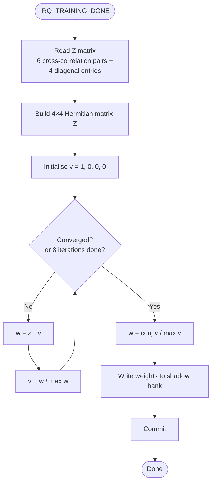
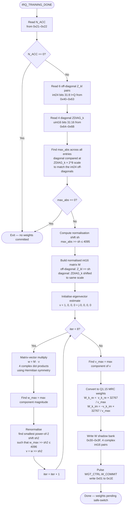

# Eigenvector Weight Computation — Firmware Implementation Spec

**Scope:** This note defines the single firmware task of computing MRC combining
weights from the training accumulator output using the principal-eigenvector
method. It is a focused handoff for one software engineer.

---

## Background

The ASIC training accumulator produces a 4×4 Hermitian channel correlation
matrix Z by accumulating all C(4,2) = 6 branch-pair cross-correlations over
the preamble training window:

```math
Z_{kl} = \sum_{n=0}^{N_{acc}-1} \text{raw}_k[n] \cdot \overline{\text{raw}_l[n]}, \quad k,l \in \{0,1,2,3\}
```

The full matrix is:

```math
Z =
\begin{pmatrix}
Z_{00} & Z_{01} & Z_{02} & Z_{03} \\
\overline{Z_{01}} & Z_{11} & Z_{12} & Z_{13} \\
\overline{Z_{02}} & \overline{Z_{12}} & Z_{22} & Z_{23} \\
\overline{Z_{03}} & \overline{Z_{13}} & \overline{Z_{23}} & Z_{33}
\end{pmatrix}
```

where the diagonal entries $Z_{kk} = \sum_n |\text{raw}_k[n]|^2$ are real and
non-negative, and $Z_{lk} = \overline{Z_{kl}}$ (Hermitian symmetry).

For a rank-1 channel $\mathbf{h}$ corrupted by white noise $\sigma^2$:

```math
Z \approx N_{acc}\left(\mathbf{h}\mathbf{h}^H + \sigma^2 I\right)
```

The dominant eigenvector of $Z$ is the link to the combiner weights. For a
rank-1 signal term, $\mathbf{h}\mathbf{h}^H$ has principal eigenvector
$\mathbf{h}$ (up to an arbitrary complex scale and phase), and the added
white-noise term $\sigma^2 I$ shifts the eigenvalues without changing that
eigenvector direction. So the largest eigenvector of $Z$ is the best estimate
of the channel vector direction. MRC then chooses weights proportional to the
conjugate of that channel estimate so that each branch is phase-aligned before
summation:

```math
\mathbf{w}_{\text{MRC}} \propto \overline{\mathbf{v}_{\max}(Z)}
```

after normalisation to fit Q1.15. Relative to the legacy row-sum path, this
uses all 16 matrix entries coherently rather than collapsing $Z$ early to one
complex value per branch. The firmware fires on `IRQ_TRAINING_DONE`, reads $Z$
from registers, computes the principal eigenvector, conjugates and normalises
it, and commits the result to the weight shadow bank before the packet
safe-switch deadline.

Reference algorithm: `sim/models/training_accumulator.py::compute_eigvec_weights()`.

---

## Algorithm Flowchart (Conceptual)



---

## Algorithm Flowchart (Fixed-Point Implementation)



---

## Platform Constraints

| Item | Value |
|---|---|
| CPU | PicoRV32 RV32IM (integer + M-extension multiply/divide; **no FPU**) |
| Clock | 16 MHz |
| SRAM | 4 KiB total (code + data + stack) |
| Arithmetic | 32-bit integer; `MUL` produces lower 32 bits; `DIV`/`REM` available |

All arithmetic must be fixed-point. There is no `float` or `double` in this
firmware.

---

## Inputs — Register Reads

Read on `IRQ_TRAINING_DONE`. All values are big-endian in the register bank.

### Off-diagonal Z_kl pairs — 6 × complex int24 (bits [31:8])

Each pair holds:

```math
Z_{kl} = \sum_n \text{raw}_k[n] \cdot \overline{\text{raw}_l[n]} = Z_{kl,I} + j \cdot Z_{kl,Q} \quad (k < l)
```

| Pair | I register (MSB) | Q register (MSB) |
|---|---|---|
| Z_01 | `0x40` | `0x43` |
| Z_02 | `0x46` | `0x49` |
| Z_03 | `0x4C` | `0x4F` |
| Z_12 | `0x52` | `0x55` |
| Z_13 | `0x58` | `0x5B` |
| Z_23 | `0x5E` | `0x61` |

Each component is 3 bytes, MSB-first, holding bits [31:8] of the int32 accumulator (i.e. `Z_kl >> 8`). See `asic_regs.h` for byte-level defines.

### Diagonal Z_kk — 4 × uint16

Bits [31:16] of the 32-bit per-branch energy accumulator:

```math
Z_{kk} = \sum_n |\text{raw}_k[n]|^2 \in \mathbb{R}_{\geq 0}
```

The register holds $\lfloor Z_{kk} / 2^{16} \rfloor$. These are real and non-negative.

| Branch | Register (MSB) |
|---|---|
| 0 | `0x64` |
| 1 | `0x66` |
| 2 | `0x68` |
| 3 | `0x6A` |

The off-diagonal readbacks hold bits [31:8] (scale 2^8) while the diagonals hold
bits [31:16] (scale 2^16). Left-shift `ZDIAG_k` by 8 to align scales when
comparing magnitude with the off-diagonal int24 values.

### Accumulation count

`N_ACC` at `0x21`–`0x22` (uint16, big-endian). Skip weight computation if
`N_ACC == 0`.

---

## Algorithm — Power Iteration

The goal is the principal eigenvector: the vector $\mathbf{v}$ satisfying

```math
Z\,\mathbf{v} = \lambda_{\max}\,\mathbf{v}
```

which is found iteratively without a full eigendecomposition.

### Step 1 — Normalise matrix entries to int12

Find the maximum absolute value across all matrix entries. Off-diagonal
readbacks are at scale 2^8 (bits [31:8]) and diagonals at scale 2^16
(bits [31:16]); left-shift `ZDIAG_k` by 8 so all entries share the 2^8 scale:

```math
M = \max\!\left(\max_{k<l}\bigl(|Z_{kl,I}|,\,|Z_{kl,Q}|\bigr),\; \max_k\, Z_{kk}\right)
```

Compute the common right-shift:

```math
\text{sh} = \max\!\left(0,\;\left\lceil\log_2\!\left(\frac{M}{4095}\right)\right\rceil\right)
```

Apply to all entries to produce the normalised int16 matrix $\tilde{Z}$:

```math
\tilde{Z}_{kl} = Z_{kl} \gg \text{sh}
```

This ensures every matrix entry satisfies $|\tilde{Z}_{kl}| \leq 4095$, so
the matrix-vector accumulations in Step 2 cannot overflow int32.

### Step 2 — Power iteration (8 iterations)

Starting vector $\mathbf{v}^{(0)} = [4096,\, 0,\, 0,\, 0]^T$ (real).

Each iteration $i = 0 \ldots 7$:

**1. Matrix-vector multiply:**

```math
\mathbf{w}^{(i)} = \tilde{Z}\,\mathbf{v}^{(i)}
```

Expanded into real and imaginary parts for row $k$, exploiting Hermitian
symmetry ($\tilde{Z}_{lk} = \overline{\tilde{Z}_{kl}}$):

```math
\text{Re}(w_k) = \sum_{l=0}^{3} \Bigl[\text{Re}(\tilde{Z}_{kl})\cdot\text{Re}(v_l) - \text{Im}(\tilde{Z}_{kl})\cdot\text{Im}(v_l)\Bigr]
```

```math
\text{Im}(w_k) = \sum_{l=0}^{3} \Bigl[\text{Re}(\tilde{Z}_{kl})\cdot\text{Im}(v_l) + \text{Im}(\tilde{Z}_{kl})\cdot\text{Re}(v_l)\Bigr]
```

where $\text{Im}(\tilde{Z}_{kl}) = -\text{Im}(\tilde{Z}_{lk})$ for $l < k$.
Each row accumulates 7 terms of (int12 × int12); the maximum sum is
$7 \times 2 \times 4095^2 \approx 235\text{M} \ll 2^{31}$, so int32
accumulators cannot overflow.

**2. Renormalise:**

```math
\text{sh}_2 = \left\lceil\log_2\!\left(\frac{\|\mathbf{w}^{(i)}\|_\infty}{4096}\right)\right\rceil, \qquad \mathbf{v}^{(i+1)} = \mathbf{w}^{(i)} \gg \text{sh}_2
```

where $\|\cdot\|_\infty$ is the maximum over all real and imaginary components.
The power-of-2 shift keeps $v$ in the ±4096 range without any multiplication.

### Step 3 — Set COMB_POST_GAIN_SHIFT and compute W_max

The combiner guard shift is `>>> 8` (Q0.7 scaling). The output before `post_gain_shift`
is:

```
y_pre ≈ W_max_byte × NR × A_est / 256
```

where `A_est` is the RMS input amplitude on the strongest branch and `NR = 4`.

**Estimate signal amplitude from Zdiag:**

```
E_max    = max(ZDIAG_k) / N_ACC       // mean energy per sample, strongest branch
A_est    = isqrt(E_max)               // integer square root; 0 if E_max == 0
```

**Choose pgs to target ~90 counts output:**

```
y_pre_max = 120 × 4 × A_est / 256    // = 1.875 × A_est  (with W_max_byte = 120)
if y_pre_max == 0:
    pgs = 0
else:
    pgs = clamp(floor_log2(90 / y_pre_max), 0, 7)
```

where `floor_log2(x)` returns 0 for x ≤ 1. For strong signals (`A_est ≥ 48`) this
yields `pgs = 0`; for weak signals it increases to recover output amplitude.

**Compute W_max_byte to avoid clipping after the shift:**

```
W_max_byte = min(120, 8128 / (A_est × (1 << pgs)))   // 8128 = 127 × 64
```

If `A_est == 0`, set `W_max_byte = 120`. This caps the weight scale for strong signals
(A_est > 64) so that `y_pre × 2^pgs ≤ 127` always holds.

**Write COMB_CFG:**

Write `pgs` to bits [2:0] of register `0x0F` (`COMB_POST_GAIN_SHIFT`) before
committing weights.

---

### Step 4 — Convert to Q1.15 weights

The MRC weight is the conjugate of the principal eigenvector, normalised so that
the top byte maps to `W_max_byte`:

```math
W_{k,\text{re}} = \left\lfloor\frac{\text{Re}(v_k) \times W_{\max} \times 256}{v_{\max}}\right\rfloor, \qquad W_{k,\text{im}} = \left\lfloor\frac{-\,\text{Im}(v_k) \times W_{\max} \times 256}{v_{\max}}\right\rfloor
```

where $W_{\max} = \texttt{W\_max\_byte}$ from Step 3 and $v_{\max} = \|\mathbf{v}^{(8)}\|_\infty$.

The factor of 256 places the result in Q1.15 so `trouper_top` extracts the correct
top byte. Both products fit in int32: $v_k \leq 4096$, $W_{\max} \leq 120$,
$256 \times 120 \times 4096 = 125\text{M} < 2^{31}$.

**Special case — strong signal (A_est > 64):** `W_max_byte < 120`, so the weight
vector uses fewer than 7 bits of effective resolution. This is acceptable because
the SNR is high and branch-ratio precision matters less than clipping avoidance.

---

## Outputs — Register Writes

### COMB_CFG — post_gain_shift

Write `pgs` (0–7) to bits [2:0] of register `0x0F` **before** writing weights, so
the combiner is configured before the weight commit promotes the shadow bank.

### W shadow bank — 8 × int16 (4 complex weights, Q1.15)

Write the four complex weights to the shadow bank. Each component is a signed
int16 written as two bytes, MSB-first. The top byte of each word is the effective
int8 weight seen by the combiner multipliers.

| Branch | RE register (MSB) | IM register (MSB) |
|---|---|---|
| 0 | `0x30` | `0x32` |
| 1 | `0x34` | `0x36` |
| 2 | `0x38` | `0x3A` |
| 3 | `0x3C` | `0x3E` |

### Commit

After writing all four weights, pulse `WGT_CTRL.W_COMMIT` (bit 0 of register
`0x1E`). Write `0x01`, then the hardware self-clears.

The Packet Control FSM will promote the shadow bank to the active combiner at
the next safe-switch boundary.

---

## Timing Budget

| Parameter | Value |
|---|---|
| CPU clock | 16 MHz |
| Estimated cycles (8 iterations, 4×4) | ~3,000–5,000 |
| Estimated wall time | ~200–300 µs |
| SF5 symbol period (worst case) | ~1 ms |

The computation should complete well within the training-done to safe-switch
window for all supported SFs (5–12). If `W_COMMIT` does not arrive in time,
`W_MISSED_PACKET` asserts and the packet stays in bypass — see the fallback
policy in `Firmware Spec.md`.

---

## What Is Out of Scope for This Task

- Noise-weighted eigenvector (requires sigma² EMA from `TACC_NOISE_TRIG` path)
- Calibration coefficient application
- Antenna masking via `ACTIVE_ANTENNA_EN`
- Warm-start from previous packet eigenvector
- Any other weight mode (MRC row-sum, EGC, SC)

These are follow-on tasks.

---

## Acceptance Criteria

1. On `IRQ_TRAINING_DONE` with non-zero `N_ACC`, firmware writes `COMB_CFG`,
   all 8 weight bytes, and pulses `W_COMMIT` within the SF5 timing budget.
2. With a known synthetic Z matrix (from the Python model), the firmware output
   matches `compute_eigvec_weights()` within ±1 LSB in Q1.15.
3. `COMB_POST_GAIN_SHIFT` is written before `W_COMMIT` for every packet.
4. For a strong-signal Z (A_est > 64), `pgs = 0` and `W_max_byte < 120`; the
   combiner output does not saturate.
5. For a weak-signal Z (A_est = 4), `pgs ∈ {2,3}` and combiner output is
   between 20 and 90 counts.
6. If `N_ACC == 0`, no weight write, no `COMB_CFG` write, and no commit occurs.
7. The implementation fits within the 4 KiB SRAM budget alongside the rest of
   the firmware (check with `make` → `size` output).

---

## Reference Files

| File | Purpose |
|---|---|
| `firmware/picorv32/asic_regs.h` | Register address definitions |
| `firmware/picorv32/main.c` | Existing firmware structure to extend |
| `sim/models/training_accumulator.py::compute_eigvec_weights()` | Float reference |
| `planning/Register Map.md` | Authoritative register layout |
| `planning/Firmware Spec.md` | Broader firmware context |
