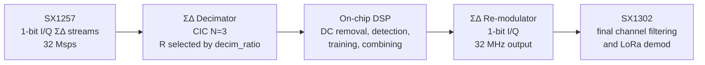
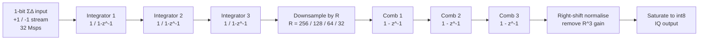
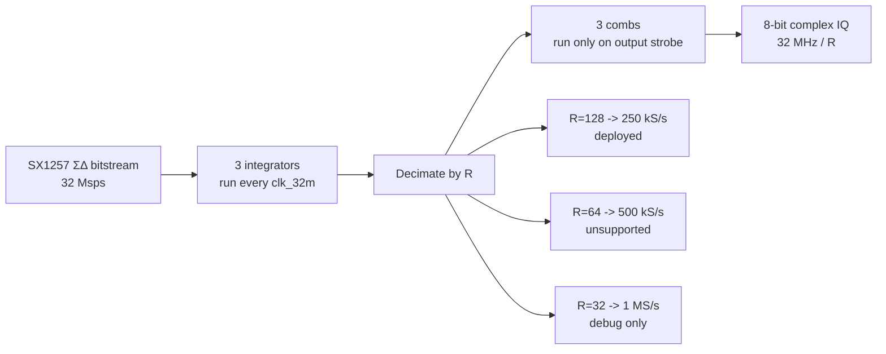
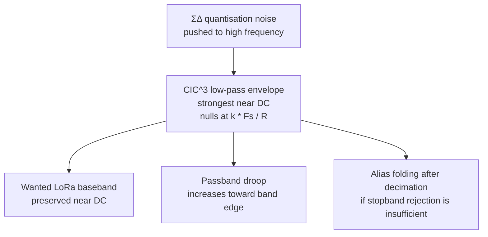
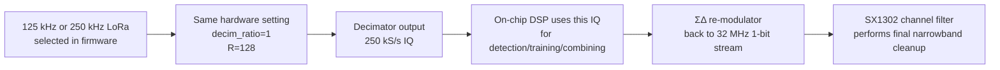
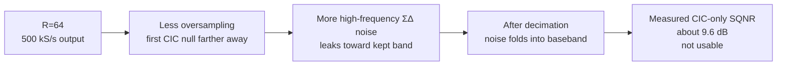

# ΣΔ Decimator

RX path stage 2. See [DSP Flow](../DSP%20Flow.md) for pipeline context.

**Owner:** TBD
**Status:** **Production = fixed R=64 half-band chain** (`sd_decimator_poly`: CIC-3 R=16 → HB1 ÷2 → HB2 ÷2 → int8 @ 500 kS/s). Migrated to production 2026-06-21.

> **The current design is the half-band chain.** Canonical detail lives in
> [`decimator-hb-redesign.md`](../decimator-hb-redesign.md) (architecture),
> [`decimator-hb-area-reduction.md`](../decimator-hb-area-reduction.md) (polyphase +
> 14-bit CIC area work) and [`decimator-hb-migration-impact-plan.md`](../decimator-hb-migration-impact-plan.md)
> (Gates 0–12). Bandwidth is selected by `BW_CFG.bw_sel` (sets `sample_shift`, not the
> decimation ratio); the chain eliminates the legacy 250 kHz droop (−11.8 dB → ≈ −0.17 dB).
> The 2×/4× oversampling margins are a hard architectural floor, not a safety
> margin — see [`decimator-hb-redesign.md#why-2-is-a-floor-not-a-conservative-margin-for-250-khz-bw`](../decimator-hb-redesign.md#why-2-is-a-floor-not-a-conservative-margin-for-250-khz-bw)
> for why 1× oversampling is infeasible for any finite-order filter in this cascade.
>
> **Everything below this banner describes the SUPERSEDED CIC-only R=128 design**
> (`sd_decimator_cic_only`, 250 kS/s) and is retained only as historical context.

---

## CIC primer (Stage 1 of the current chain)

A CIC (Cascaded Integrator-Comb) filter is a decimating low-pass filter built
entirely from adders/accumulators — no multipliers. It's the standard
front-end for converting a high-rate 1-bit ΣΔ bitstream down to a lower rate
with modest hardware, and is exactly what Stage 1 of `sd_decimator_poly` does
(`sd_decimator_poly_cic_comb` + the three integrators) before the HB1/HB2 FIR
stages take over.

### Two halves, two rates

**Integrators** run at the fast input rate (32 MS/s). Each is a plain
accumulator, `y[n] = y[n-1] + x[n]` — transfer function `1/(1-z⁻¹)`. Three are
cascaded per channel:

```verilog
int_i1[ch] <= int_i1[ch] + (iq_in_i[ch] ? 14'sd1 : -14'sd1);  // integrator 1
int_i2[ch] <= int_i2[ch] + int_i1[ch];                          // integrator 2
int_i3[ch] <= int_i3[ch] + int_i2[ch];                          // integrator 3
```

The 1-bit ΣΔ stream is converted to ±1 first, then integrated three times in
series.

**Combs** run at the slow output rate (2 MS/s here — every 16th cycle). A
comb is a differentiator, `y[n] = x[n] - x[n-R]` — transfer function
`1 - z⁻ᴿ`, `R` = decimation ratio. Three are cascaded, evaluated only when the
CIC strobe fires:

```verilog
assign comb1 = int3 - comb1_z;   // comb1_z = int3 delayed by one decimated sample
assign comb2 = comb1 - comb2_z;
assign comb3 = comb2 - comb3_z;
```

The key trick: because the combs only need to run at the decimated rate,
decimation happens for free between the integrator cascade and the comb
cascade — no separate anti-alias filter is needed before downsampling, since
the integrators' own gain already provides the shaping.

### Why 3 stages (N=3)

Cascading N integrator/comb pairs raises the whole response to the Nth power:

```
H(z) = ( (1 - z⁻ᴿ) / (1 - z⁻¹) )^N
```

Each extra stage buys steeper rolloff and better alias rejection at the
decimation point, at the cost of more registers and more passband droop near
the band edge. N=3 is the conventional sweet spot for ΣΔ front-ends.

### Bit growth and the final shift

Worst-case DC input, the accumulator gain after decimation is `R^N`. For this
stage's R=16, N=3, that's `16³ = 4096 = 2^12`. `int_i1/2/3` are sized 14-bit
to hold that growth; after the 3 combs collapse it back down,
`sample8 = (comb3 + 16) >>> 5` removes the residual gain and saturates to
signed 8-bit.

### Why no multipliers

Every stage is a plain add/subtract on an accumulator. That's the appeal of
CIC for this application: the SX1257 gives a 1-bit stream at 32 MS/s, and a
naive FIR decimator at that rate would need a multiply-accumulate running at
32 MHz — expensive in area and power. CIC replaces that with pure adders,
which is why it's the standard choice ahead of the (multiplier-based)
half-band FIRs in this chain — HB1/HB2 only need to run at 2 MS/s and 1 MS/s
respectively, so multiply cost there is much cheaper.

Note this CIC stage in the current chain is R=16 only, not the full R=64 —
the remaining ÷4 comes from HB1 (÷2) and HB2 (÷2), which restore the passband
flatness that a CIC-only design (the superseded R=128 design described below)
would otherwise sacrifice.

## HB1 and HB2 primer (Stages 2 and 3 of the current chain)

Where the CIC stage above uses pure adders, HB1 and HB2 are proper FIR
filters with multipliers — but a special class called **half-band filters**,
chosen because a 2:1 decimating half-band throws away half its own
arithmetic for free.

### What makes a filter "half-band"

A half-band FIR is a symmetric lowpass filter designed so its cutoff sits at
exactly Fs/4 (half of Nyquist). That symmetry has a well-known side effect:
**every even-indexed tap except the centre tap is exactly zero**. For a
filter that's about to be evaluated only every 2nd input sample anyway (a
decimate-by-2 filter), this is a huge win — roughly half the multiply-adds a
same-length ordinary FIR would need are already zero, so they're never
computed.

### Polyphase split

Because the decimating half-band only ever evaluates its output on every
other input sample, and the odd taps are zero, the delay line naturally
splits into two independent halves that shift at different times:

- **Phase A** — the nonzero even-lag taps (HB1: lags 0,2,4,6,8,10; HB2: lags
  0,2,...,14). This line shifts once per *input* sample.
- **Phase B** — just the centre tap (HB1: lag 5; HB2: lag 7). This line
  shifts on the alternating half.

Each polyphase branch only holds ~N/2 registers instead of N, and the MAC
still reads exactly the same sample values a direct-form implementation
would — the output is bit-exact with a non-polyphase reference; it's just
organized to avoid storing (and multiplying by) the taps that are always
zero.

In the RTL (`sd_decimator_poly.v`), each channel gets its own phase-A/phase-B
storage arrays (`h1a_i/q`, `h1b_i/q` for HB1; `h2a_i/q`, `h2b_i/q` for HB2),
and which phase gets written on a given strobe is tracked by `hb1_phase` /
`hb2_phase` toggle bits.

### HB1 — first ÷2 stage

Takes the CIC output (2 MS/s) down to 1 MS/s. 6 nonzero even-lag coefficients
plus the centre tap, folded by symmetry (`tap[k] == tap[10-k]`) so the MAC
only needs 4 distinct multiplies:

```verilog
acc = 19  * (a0 + a5)     // lags 0,10
    - 73  * (a1 + a4)     // lags 2,8
    + 312 * (a2 + a3)     // lags 4,6
    + 512 * centre;       // lag 5 (centre tap, always kept)
scaled = (acc + 512) >>> 10;
```

The `+512 >>> 10` is rounding to nearest before truncating back to int8 —
`512 = 2^9`, half an LSB at the `>>>10` scale.

Because this MAC is a deep combinational cone (~40 logic levels) that can't
settle in one 31.25 ns cycle at the SS timing corner, it's evaluated once per
stream (8 streams: 4 channels × I/Q) with 3-cycle pacing
(`hb1_wait`/`MAC_WAIT`), covered by a `set_multicycle_path 3` in the SDC —
the same honest-multicycle fix applied to the CIC stage.

**The `h1bc_snap` wrinkle:** the centre tap shifts every 16 clocks (CIC
cadence), but a full 8-stream HB1 burst now takes 24 paced clocks — longer
than the shift period. So the centre value is snapshotted (`h1bc_snap_i/q`)
at the start of the burst and held fixed for all 8 streams, so a mid-burst
shift can't corrupt the value partway through.

### HB2 — second ÷2 stage

Takes HB1's 1 MS/s output down to the final 500 kS/s. Same polyphase idea,
one size up: 8 nonzero even-lag taps plus centre, folded to 4 distinct
multiplies:

```verilog
acc = -27 * (a0 + a7)     // lags 0,14
    + 45  * (a1 + a6)     // lags 2,12
    - 96  * (a2 + a5)     // lags 4,10
    + 321 * (a3 + a4)     // lags 6,8
    + 512 * centre;       // lag 7
scaled = (acc + 512) >>> 10;
```

The alternating sign pattern (−, +, −, +) in both HB1 and HB2 is a signature
of a well-designed half-band lowpass: near taps reinforce and far taps
partially cancel ringing, shaping a raised-cosine-like response.

HB2 fires once per 64-clock window per stream, also 8 streams TDM'd, also
3-cycle paced (`hb2_wait`). Feeding it: `insert_hb2_frame` shifts HB1's
*already-decimated* output samples into HB2's own phase-A/phase-B lines — so
HB2's delay line runs at 1 MS/s tap-spacing, one rate below HB1's.

### Why droop nearly vanishes vs. CIC-only

A pure 3rd-order CIC has significant passband droop that gets worse toward
the band edge (that's the whole story of the superseded CIC-only R=128
design below). HB1+HB2 exist specifically to claw that back: each half-band
stage is designed with an optimized passband, so the cascade holds the LoRa
passband to ≈ −0.17 dB instead of the CIC-only chain's −11.8 dB at 250 kHz
BW — at the cost of two real multiplier MACs instead of zero.

### Where the coefficient values came from

The integer taps in `sd_decimator_poly_hb1_mac` / `_hb2_mac` (`19, -73, 312,
512` and `-27, 45, -96, 321, 512`) are not hand-picked — they're a
Parks-McClellan (Remez) equiripple half-band design, quantized to Q10
fixed-point. Reproducible with `scipy.signal.remez`:

```python
import numpy as np
from scipy.signal import remez

# HB1: 11 taps, fs=2 MHz. Passband edge 300 kHz (guard above the 250 kHz
# chirp edge), stopband edge 700 kHz -- both symmetric about Fs/4 = 500 kHz,
# which is what makes this a half-band design (forces even taps to zero).
h1 = remez(11, [0, 300e3, 700e3, 1e6], [1, 0], fs=2e6)
q1 = np.round(h1 * 1024).astype(int)
# -> [19, 0, -73, 0, 312, 512, 312, 0, -73, 0, 19]  (matches RTL exactly)

# HB2: 15 taps, fs=1 MHz. Passband edge 200 kHz, stopband edge 300 kHz,
# symmetric about Fs/4 = 250 kHz.
h2 = remez(15, [0, 200e3, 300e3, 500e3], [1, 0], fs=1e6)
q2 = np.round(h2 * 1024).astype(int)
# -> [-27, 0, 45, 0, -96, 0, 321, 512, 321, 0, -96, 0, 45, 0, -27]  (matches RTL exactly)
```

Steps:

1. **Set the spec from the band-edge requirements** in the table above (HB1:
   pass 0–300 kHz / stop 700 kHz–1 MHz at fs=2 MHz; HB2: pass 0–200 kHz /
   stop 300–500 kHz at fs=1 MHz). Both band pairs are symmetric about Fs/4 —
   that symmetry is the half-band constraint, and it's what forces every
   even-indexed tap except the centre to zero once Remez optimizes against
   it (it isn't imposed separately; it falls out of the equiripple solution
   for these particular edges).
2. **Run Remez** to get the optimal equiripple floating-point taps for the
   target tap count (11 / 15).
3. **Quantize to Q10**: multiply by `1024 = 2^10` and round to nearest
   integer. This is why the MAC does `>>>10` and why the centre tap is
   exactly `512` (a half-band centre tap is always `0.5` in float, so
   `0.5 × 1024 = 512` exactly).
4. **Fold by linear-phase symmetry** (`tap[k] == tap[N-1-k]`) so the RTL only
   stores and multiplies the distinct pairs (`a0+a5`, `a1+a4`, `a2+a3`,
   `centre` for HB1; similarly 4 pairs for HB2) instead of all 11/15 taps —
   this is why each MAC only needs 3–4 distinct multiply constants.

Re-running this recipe reproduces the deployed RTL coefficients bit-for-bit,
so it's the traceable source of truth if the passband/stopband spec ever
needs to change.

---

## Function

Converts each SX1257 1-bit complex sigma-delta stream into signed 8-bit complex IQ samples for the on-chip receive chain. There is one identical decimator per antenna branch.

The input bitstream runs at **32 Msps**, clocked by `clk_32m`. Each CIC integrator stage advances on every `clk_32m` cycle, so the CIC input rate equals the clock rate.

The production implementation is **CIC-only**:

- 3 CIC integrator stages running at `clk_32m`
- 3 CIC comb stages evaluated on the decimation strobe
- fixed per-rate right-shift normalisation
- 8-bit output saturation
- no FIR compensation, no multiplier, no `clk_16m` logic

The deployed RTL is [`rtl-test/sd_decimator_cic_only.v`](../../rtl-test/sd_decimator_cic_only.v).

---

## System-level operating point

The block interface still supports four `decim_ratio` encodings, but the **system specification supports only two LoRa bandwidths** and uses a single runtime setting in normal operation:

| LoRa BW | Firmware setting | CIC ratio | Output rate | Samples/symbol | Support status |
| --- | --- | --- | --- | --- | --- |
| 125 kHz | `decim_ratio=1` | R=128 | 250 kS/s | `2^(SF+1)` | Supported |
| 250 kHz | `decim_ratio=1` | R=128 | 250 kS/s | `2^SF` | Supported |
| 500 kHz | `decim_ratio=2` | R=64 | 500 kS/s | `2^SF` | Not supported in product |
| 500 kHz, 2× OS | `decim_ratio=3` | R=32 | 1 MS/s | `2^(SF+1)` | Debug / lab only |
| 125 kHz, 1× Nyquist | `decim_ratio=0` | R=256 | 125 kS/s | `2^SF` | Legacy analysis only |

**Important system decision:** both supported bandwidths run at `R=128`. For 125 kHz LoRa this is intentionally 2× oversampled at the ASIC IQ boundary; the downstream `sd_remod` and SX1302 channel filter absorb the extra bandwidth.

---

## Why CIC-only is acceptable in the deployed design

The original FIR-compensated decimator was dropped for area. CIC-only is acceptable for the shipped receive path because the system no longer exposes the CIC output directly to a LoRa demodulator.

The deployed chain is:

```text
SX1257 ΣΔ ADC -> CIC decimator -> on-chip DSP -> ΣΔ re-modulator -> SX1302
```

### Deployed receive-path context



That changes the requirement:

- the ASIC only needs enough IQ fidelity for on-chip detection, training, combining, and re-modulation
- the final LoRa channel filtering is performed downstream by the SX1302
- 125 kHz mode can therefore run at 250 kS/s without requiring a flat FIR-equalised 125 kS/s handoff

Measured RTL result from [`planning/cic-only-decimator-findings.md`](../cic-only-decimator-findings.md):

- `R=128` gives about **30.6 dB SQNR**, which passes the adopted 28 dB floor
- `R=64` gives about **9.6 dB SQNR**, so 500 kHz mode is not supported

---

## Interface

The production module keeps the old drop-in port list for compatibility with earlier wrappers.

| Port | Direction | Width | Description |
| --- | --- | --- | --- |
| `clk_32m` | in | 1 | Main sample clock; all active logic runs here |
| `clk_16m` | in | 1 | Accepted for compatibility, unused internally |
| `rst_n` | in | 1 | Active-low reset |
| `iq_in_i` | in | 1 | I sigma-delta bitstream from SX1257 |
| `iq_in_q` | in | 1 | Q sigma-delta bitstream from SX1257 |
| `decim_ratio` | in | 2 | Ratio select: `0=R256`, `1=R128`, `2=R64`, `3=R32` |
| `iq_out_i` | out | 8 signed | Saturated decimated I sample |
| `iq_out_q` | out | 8 signed | Saturated decimated Q sample |
| `iq_valid` | out | 1 | Output-valid strobe, stretched to 2 `clk_32m` cycles |

---

## Parameters and scaling

| Item | Value | Notes |
| --- | --- | --- |
| CIC stages `N` | 3 | Same for I and Q |
| Integrator / comb width | 26-bit signed | Sized for worst-case growth at `R=256` |
| Output width | 8-bit signed | Saturated, not rounded-to-nearest |
| Normalisation shift | `17 / 14 / 11 / 8` | For `R=256 / 128 / 64 / 32` |
| Decimation counter compare | `255 / 127 / 63 / 31` | Produces strobe every `R` input samples |

CIC gain is `G = R^3`, so the per-rate right shift is:

- `R=256 -> 24 - 7 = 17`
- `R=128 -> 21 - 7 = 14`
- `R=64  -> 18 - 7 = 11`
- `R=32  -> 15 - 7 = 8`

This matches the implemented `norm_shift` mapping in the RTL.

---

## DSP view

### CIC signal-processing structure



This is a standard 3rd-order CIC decimator:

- transfer function: `H(z) = ((1 - z^-R) / (1 - z^-1))^3`
- low-pass action comes from the moving-average envelope implicit in the CIC
- DC gain is `R^3`, which is why the RTL applies a rate-dependent right shift

### Rate-domain view



The important DSP point is that the integrators see the full 32 Msps noise-shaped stream, but the comb/output side runs at the reduced sample rate. That is where the area win comes from.

### Frequency-response intuition



For this design, the tradeoff is:

- higher `R` gives more oversampling and better alias rejection after decimation
- lower `R` pushes the first CIC null outward and leaves more shaped ΣΔ noise near the kept band
- without the FIR compensator, passband droop remains, but that is acceptable at the deployed operating point

### Why `R=128` works in product



Why this is acceptable:

- at `R=128`, measured CIC-only SQNR is about `30.6 dB`, above the adopted 28 dB floor
- 125 kHz mode is intentionally handed off at 2x oversampling (`250 kS/s`), so the downstream path still has filtering margin
- the SX1302, not the decimator, performs the final LoRa channel filtering

### Why `R=64` fails for 500 kHz mode



This is the core DSP reason 500 kHz mode is out of spec in the CIC-only design: the 3rd-order CIC by itself does not provide enough rejection at `R=64` once the FIR is removed.

---

## Timing and latency

Pipeline structure in the deployed RTL:

1. integrators update every `clk_32m` cycle
2. when the decimation counter hits the selected terminal count, `cic_strobe` pulses
3. comb subtraction and right shift are evaluated on that strobe
4. one cycle later the output register latches `iq_out_i/q`
5. `iq_valid` stays high for **two** `clk_32m` cycles so slower consumers derived from `/2` clocks cannot miss it

The block therefore has deterministic fixed latency and remains phase-aligned across branches as long as all instances share the same clock, reset, and `decim_ratio`.

---

## Multi-branch coherence requirement

The training accumulator and combiner assume all receive branches are sample-aligned. A permanent one-sample offset between decimator instances silently corrupts cross-correlation.

Required conditions:

- all instances share the same `clk_32m`
- all instances share the same `decim_ratio`
- reset release must be phase-consistent across all instances so the decimation counters start together

Physical checks to keep in the top-level signoff list:

- verify clock skew is comfortably below one `clk_32m` period
- verify reset distribution or use a shared synchronised reset release before the decimator bank

---

## Supported vs unsupported modes

### Supported product modes

- `125 kHz BW` with `decim_ratio=1` (`R=128`, 250 kS/s)
- `250 kHz BW` with `decim_ratio=1` (`R=128`, 250 kS/s)

### Unsupported in product

- `500 kHz BW` with `decim_ratio=2` because CIC-only SQNR is too low

### Retained only for compatibility / lab work

- `decim_ratio=0` (`R=256`)
- `decim_ratio=3` (`R=32`, 1 MS/s)

These modes remain encoded in the module interface and are useful for bench comparison, but they are not part of the ASIC system specification.

---

## Rejected alternative: `sd_decimator_cic_tdm8` (earlier R=256 variant)

> **Note:** this section describes an **earlier R=256 variant** that carried the
> same filename. The RTL currently on disk is the **R=128 (250 kS/s)** staged
> TDM experiment described under
> [2026-06-11 structural TDM experiment](#2026-06-11-structural-tdm-experiment),
> which does **not** suffer the rate/BW objections below.

The earlier `sd_decimator_cic_tdm8` implemented a boxcar-4 pre-stage + 4-slot TDM CIC(N=3, R=64) across all 4 channels. It was evaluated and **rejected** for the following reasons:

- **Fixed at R=256 (125 kHz only).** The system requires both 125 kHz and 250 kHz BW modes, both served at R=128 by `sd_decimator_cic_only`. Using `tdm8` eliminates 250 kHz mode permanently.
- **Output rate halves** from 250 kS/s to 125 kS/s. Every downstream block (`dc_removal`, `sc_detector`, `mrc_combiner`, front buffer write rate, SDC input delay) was sized for 250 kS/s — a non-trivial re-verification burden.
- **Area saving is too small to justify the risk.** Synthesis shows 256,779 µm² vs 300,207 µm² for 4× CIC-only — a saving of ~43 kµm² (14.5% of the decimator block, ~2.3% of die area). This does not unlock any new floorplan floor.
- No FIR compensation (identical signal quality to current CIC-only).

The module stays on disk as a synthesis reference. It will not be instantiated in `trouper_top.v`.

---

## Current area context

Fresh `chipathon26` FD-cell synthesis of the current standalone `trouper_top`
(`2026-06-11`, current checked-in RTL boundary with `spi_slave`) gives:

- total flat top area: **~879.9 kµm²**
- decimator contribution: **4 × 75.1 kµm² = 300.2 kµm²**
- decimator share of current top: **~34.1%**

Current top-level area ranking after the decimator bank:

- `training_acc`: ~132.1 kµm²
- `sc_detector`: ~107.2 kµm²
- `reg_bank`: ~83.7 kµm²
- `mrc_combiner`: ~61.8 kµm²

This confirms that the decimator bank is still the single largest remaining
area lever in the current `trouper_top`.

### 2026-06-11 structural TDM experiment

A new synthesis-only test RTL at
[`rtl-test/rtl/sd_decimator_cic_tdm8.v`](../../rtl-test/rtl/sd_decimator_cic_tdm8.v)
was written to estimate a more aggressive staged TDM architecture:

- per-branch **boxcar-4** front end at `32 MHz`
- shared **4-slot CIC** back end with total `R=128`
- integrated local scheduler / buffering / common `iq_valid` release

Measured standalone synthesis result:

| Variant | Area |
| --- | --- |
| `sd_decim_4ch_cic_only` | **300.2 kµm²** |
| `sd_decimator_cic_tdm8` test RTL | **207.1 kµm²** |
| Delta | **−93.1 kµm²** (**−31%**) |

Important scope note:

- this is a **structural area experiment only**
- it **does include** local TDM control logic
- it is now **simulation-validated** (see below) but **not** integrated into `trouper_top`
- the area number above predates the 2026-06-11 functional fixes (which added a
  4-way slot mux ahead of the shared CIC adders and changed a shift constant) —
  **re-synthesise before quoting**; the delta is expected to be small

### 2026-06-11 functional validation and fixes

The test RTL was simulation-checked against `sd_decimator_cic_only` at R=128
(iverilog, SGE jobs 1608/1612; testbench at
[`rtl-test/tb/tb_sd_decimator_cic_tdm8.v`](../../rtl-test/tb/tb_sd_decimator_cic_tdm8.v),
rerunnable via `/srv/eda/designs/timothyjabez/lora-mimo/tdm8_check/run_sim.sh`).
The TB drives all 4 branches and the reference with the same 1st-order ΣΔ
bitstream (DC at 0.5 FS, then a 30 kHz sine at 0.7 FS) and measures output
rate, amplitude, branch consistency, and Stage A frame drops.

Two functional bugs were found and fixed:

1. **Shared-stage overrun (1 in 5 frames dropped).** Stage A produced a
   4-branch frame every 4 clocks but the shared stage spent 5 clocks per frame
   (1 pickup + 4 slots), so every 5th frame was overwritten in the double
   buffer before being read — effective decimation 160 instead of 128
   (200 kS/s instead of 250 kS/s). Fixed by folding frame pickup into the
   slot-0 processing cycle (combinational `proc_en`/`proc_slot`/`proc_bank`
   view; pickup now sets `slot <= 1`), making the sweep exactly 4 clocks.
2. **Normalisation shift wrong by 7 bits.** Chain gain is boxcar-4 × 32³ =
   2¹⁷, so full scale needs `>>> 10` to map to int8 — the code used `>>> 17`
   (copied from the R=256 case of `sd_decimator_cic_only`, gain 2²⁴), which
   quantised the output to {−1, 0, +1}.

Post-fix results (800k cycles, both phases):

| Metric | tdm8 | `cic_only` R=128 |
| --- | --- | --- |
| Output interval (min/max) | 128/128 clk | 128/128 clk |
| Max \|out\| DC @ 0.5 FS | 64 | 64 |
| Max \|out\| sine @ 0.7 FS | 83 | 84 |
| Stage A frame overwrites | 0 | — |
| Inter-branch byte mismatches | 0 / 6249 samples | — |

The ±1 LSB amplitude difference vs the reference is expected: the
boxcar-4 + CIC-32 partition has a slightly different passband response than a
monolithic CIC-128; bit-exactness is not a goal.

**Branch synchronism:** the TDM is an internal processing-order detail only.
All branches share one `box_cnt` (identical input windows), the per-slot
`decim_cnt` counters stay in lockstep, and outputs are released atomically
with a common `iq_valid = 4'b1111` — zero inter-branch skew, same contract as
4× `cic_only` under common reset. Absolute group delay differs from
`cic_only` by ~100 ns (common-mode across branches), so the two decimator
types must not be mixed across branches in one chip.

Practical estimate for a hardened version of this idea is roughly **220–240 kµm²**
once extra verification-grade control and alignment logic are added. If that
estimate holds, the current top-level `trouper_top` would drop from ~879.9 kµm²
to roughly **800–820 kµm²**, with the decimator bank falling from ~34% of top
area to roughly **26–29%**.

---

## Optional FIR Upgrade

If late-stage P&R leaves headroom, the decimator can be upgraded to a shared **TDM+FIR** implementation that restores FIR compensation while still reducing area versus the old 4× FIR design.

### When to do it

Only take this upgrade if all of the following are true after top-level P&R:

- timing closes cleanly at 32 MHz
- DRC/LVS are clean
- floorplan utilisation is at or below about 55%
- at least ~86 kµm² of area headroom remains
- schedule still has several days before tapeout freeze

Otherwise ship the current CIC-only path.

### What it buys

| Metric | CIC-only current | Optional TDM+FIR |
| --- | --- | --- |
| Decimator area | ~300 kµm² | ~214 kµm² |
| Sensitivity / passband | droop accepted | full FIR-compensated response |
| Multiplier count | 0 | 1 shared 13×16 MAC |
| Status | deployed | optional late-stage upgrade |

The point of this upgrade is not to restore the old large FIR architecture. The point is to keep the FIR benefit while sharing the expensive arithmetic across channels.

### Architecture summary

The concise structure is:

```text
sd_decimator_top
|- sd_cic_chan  x4   (per-channel CIC path at 32 MHz)
|- sd_fir_state x4   (per-channel FIR delay state)
`- sd_fir_mac   x1   (shared FIR MAC / scheduler)
```

Guiding constraint:

- CIC integrators stay per-channel because folding them would require a much faster clock
- FIR arithmetic is the part worth sharing because it only runs at the decimated rate

### Implementation status

Relevant RTL already exists:

- [`rtl-test/sd_cic_chan.v`](../../rtl-test/sd_cic_chan.v)
- [`rtl-test/sd_fir_state.v`](../../rtl-test/sd_fir_state.v)
- [`rtl-test/sd_fir_mac.v`](../../rtl-test/sd_fir_mac.v)
- [`rtl-test/sd_decimator_top.v`](../../rtl-test/sd_decimator_top.v) — integration wrapper / upgrade target

### Minimum upgrade plan

1. Wire `sd_decimator_top` around the existing `sd_cic_chan`, `sd_fir_state`, and `sd_fir_mac` blocks.
2. Re-run SQNR and loopback regressions against the CIC-only baseline.
3. Swap the 4× `sd_decimator_cic_only` instances in `trouper_top` for the shared top wrapper.
4. Re-run synthesis and P&R; keep the upgrade only if timing and routing still close.

### Upgrade risks

- routing congestion from concentrating FIR traffic into one shared block
- scheduler / handshake bugs in the shared FIR sequencing
- lower-than-expected area win if the shared wrapper overhead eats into the saving

---

## Verification

| Test | Method | Pass criterion |
| --- | --- | --- |
| Ratio decode | Simulate all 4 `decim_ratio` values | Output rate matches selected `R` |
| Output strobe stretch | Check `iq_valid` width | Exactly 2 `clk_32m` cycles |
| DC scaling | Drive constant `+1/-1` stream | No overflow beyond 8-bit saturation behavior |
| Supported-mode SQNR | RTL tone test at `R=128` | `SQNR >= 28 dB` |
| Unsupported-mode guardrail | RTL tone test at `R=64` | Confirms 500 kHz mode remains below spec and unsupported |
| Branch alignment | Instantiate 4 identical decimators | Coincident `iq_valid`; identical outputs for identical inputs |
| FIR-upgrade gate | If TDM+FIR is enabled, compare against CIC-only and re-run top-level P&R | Keep only if SQNR improves and timing/routing still close |

Primary reference result: [`planning/cic-only-decimator-findings.md`](../cic-only-decimator-findings.md).

---

## Related blocks

- [DSP Flow](../DSP%20Flow.md)
- [DC Removal](DC%20Removal.md)
- [Frontend Buffer Controller](Frontend%20Buffer%20Controller.md)
- [Training Accumulator](Training%20Accumulator.md)
- [MRC Combiner](MRC%20Combiner.md)
- [ΣΔ Re-modulator](ΣΔ%20Re-modulator.md)
- [Register Map](../Register%20Map.md)
