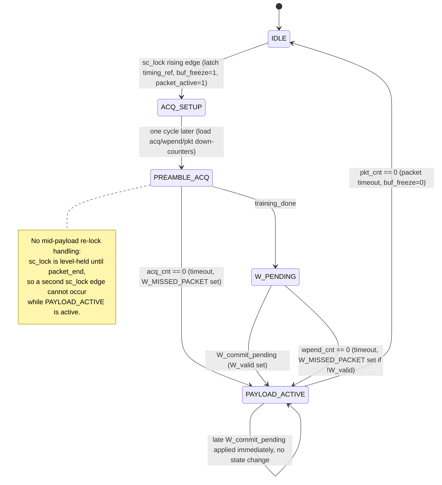
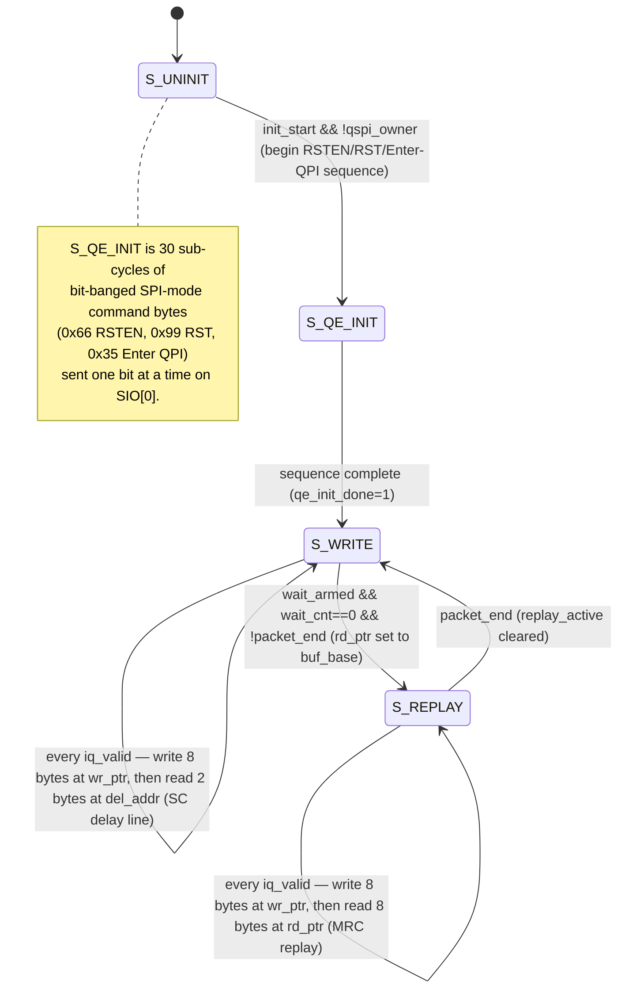
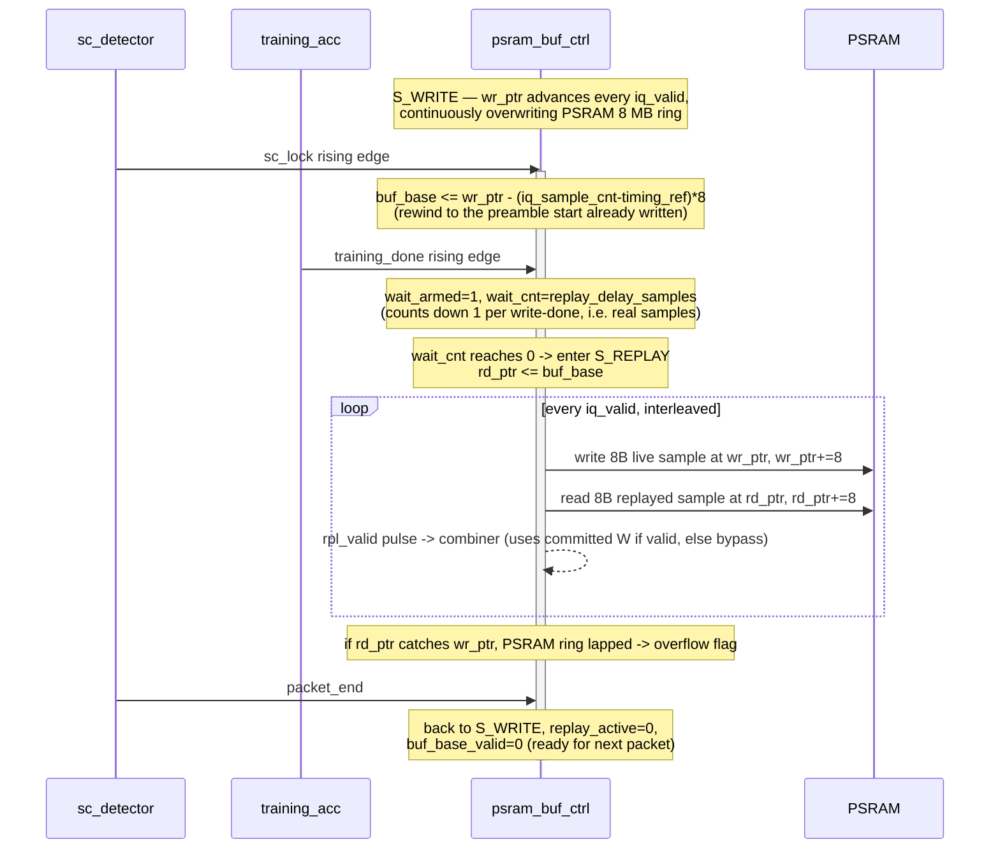

# src/control/ — Control Plane Overview

Plain-language onboarding notes for `psram_buf_ctrl.v`, `packet_ctrl_fsm.v`,
`reg_bank.v`, and `spi_slave.v`. For requirement-level detail see
`planning/Traceability.md`; for the register map see `planning/Register Map.md`.

## How the four blocks fit together

The chip exposes one shared register "mailbox" (addresses 0x00–0x7F) that both
a host Raspberry Pi (over SPI) and the Grouper inter-project bus can read and
write. Roughly:

```
RPi ── SPI ──> spi_slave.v ───┐
                              ├──> reg_bank.v <──> packet_ctrl_fsm.v
Grouper bus ──────────────────┘          ^                │
                                         │                v
                                   psram_buf_ctrl.v <── (packet state)
```

- **`spi_slave.v`** — the mailman. Speaks the SPI protocol to the host RPi and
  translates each transaction into a "read/write register X" request.
- **`reg_bank.v`** — the mailbox. Holds every config knob (SF, bandwidth,
  thresholds, gains) and status/telemetry bit (IRQ flags, training results,
  weight state, PSRAM status).
- **`packet_ctrl_fsm.v`** — the traffic conductor. Watches for an incoming
  LoRa packet and walks it through phases: detect preamble → wait for
  training → apply antenna-combining weights → receive payload → back to
  idle.
- **`psram_buf_ctrl.v`** — the tape recorder. Continuously streams incoming
  IQ samples to external PSRAM so the *same* packet can be replayed once
  firmware has computed the optimal per-antenna combining weights for it
  ("same-packet MRC").

## `reg_bank.v` — the mailbox

Registers are one byte each, addressed 0x00–0x7F (7-bit — a hard constraint
from the SPI command byte format, see `spi_slave.v`). Two patterns recur
throughout:

- **Sticky status bits** (e.g. `irq_status`): once a hardware event sets a
  bit, it stays set — even after the event itself has passed — until
  firmware explicitly clears it (writing 1 to `IRQ_CLEAR` at 0x03). This is
  deliberate: it lets firmware catch a brief event even if it was too slow to
  poll for it at the exact moment it happened.
- **`irq_out = |irq_status`** — "OR all the interrupt bits together." If any
  status bit is set, this single wire goes high and drives a physical
  interrupt pin. Firmware can sleep until the pin fires instead of
  constantly polling the register, then go read *which* bit tripped.
  Coverage note: every test checks the `irq_status` *register* logic, but no
  test currently samples the physical `IRQ_OUT`/`IRQ_GROUPER` *pins*
  themselves (`planning/Traceability.md` TRPR-IRQ-003/004).

- **W-shadow write-lock**: firmware stages new antenna-combining weights in
  a "shadow" register area (0x30–0x3F) before committing them live. If
  firmware tries to overwrite the shadow *while the previously committed
  weights are still in use* (`W_valid` high), the write is silently dropped
  — the hardware just remembers it happened, via a sticky `w_wr_rejected`
  flag (readable at `WGT_CTRL[5]`, cleared by writing that bit back to 1).
  Firmware is expected to poll `W_VALID` (`WGT_CTRL[1]`, same register) and
  only write once it reads 0 — the lock/reject flag is a hardware backstop
  for the race between that check and the write actually landing (e.g. a new
  packet locks and sets `W_valid` mid-write), not the primary mechanism
  firmware should rely on. This is a real firmware gotcha: write at the
  wrong time and your update is lost with no immediate error, only a flag
  you have to think to check. This behavior currently has no corresponding
  requirement row in `planning/Traceability.md` and no dedicated test.

## `spi_slave.v` — the mailman

Speaks SPI Mode 0 (idle clock low, sample on rising edge), MSB-first, up to
10 MHz. Frame shape:

```
byte 0: [7]=R/W#  [6:0]=register address     (command byte)
byte 1..N: data bytes (write data on MOSI, or read data on MISO)
```

While the host keeps chip-select low, each additional data byte
auto-advances to the *next* register address (a "burst" — handy for
reading/writing several registers in one transaction), wrapping at the
7-bit boundary. One exception: register `0x76` (`PSRAM_DBG_DATA`) does
**not** auto-advance — repeated reads there are meant to drain one PSRAM
sample byte-by-byte from a fixed port.

Everything here crosses from the asynchronous SPI clock domain into the
chip's 32 MHz domain via toggle synchronizers, so a completed
read/write event survives even if the host deselects the chip
immediately afterward.

### Why `PSRAM_DBG_DATA` (0x76) is a "drain port" instead of a normal register

SPI and PSRAM are two entirely separate physical buses — SPI only ever talks
to `reg_bank.v`'s 128 pigeonholes (0x00–0x7F); it has no wires to PSRAM at
all. The only way to see PSRAM contents over SPI is to ask
`psram_buf_ctrl.v` (the only block with QPI wires to the PSRAM chip) to go
fetch some bytes and hand them back through the register file. Two things
follow from that:

1. **The PSRAM address (23 bits, 8 MB) can't fit in the SPI address space
   (7 bits, 128 slots).** So it's written separately, split across three
   registers (`0x72`/`0x73`/`0x74`), rather than being "the" SPI address.
2. **Fetching over QPI takes real time**, and `psram_buf_ctrl.v` is usually
   busy doing its main job (continuous capture + delay-line reads). So a
   debug read can't be instant like a normal register read — it's a
   trigger-and-wait: write the address (0x72–0x74) → strobe `RD_TRIG`
   (0x75[0]) → poll `DBG_BUSY` (0x75[7]) until the fetch completes → then
   read the 8 bytes it brought back.

Those 8 bytes all live in one internal 64-bit buffer (`psram_buf_ctrl.v`'s
`dbg_buf`), so `0x76` is just a fixed "window" onto it — each read returns
the next byte via an internal counter (`dbg_idx`), without the SPI address
itself ever changing. That's why 0x76 is excluded from auto-increment: the
thing doing the advancing is a hardware-side byte counter, not the SPI
address. `AUTO_INC` (0x75[1]) then lets that same fixed port re-trigger a
fresh fetch at `addr+8` after every 8th byte, so a whole run of PSRAM can be
scanned without ever rewriting 0x72–0x74.

## `packet_ctrl_fsm.v` — the traffic conductor

States: `IDLE → PREAMBLE_ACQ → W_PENDING → PAYLOAD_ACTIVE → back to IDLE`
(with a one-cycle `ACQ_SETUP` step in between IDLE and PREAMBLE_ACQ to load
timeout counters cleanly). In words:

1. **IDLE**: waiting for a preamble lock (`sc_lock`) from the Schmidl-Cox
   detector.
2. **PREAMBLE_ACQ**: lock seen, now waiting for the training accumulator to
   finish measuring the 4 antennas' correlation (`training_done`). Times
   out and proceeds anyway if training takes too long.
3. **W_PENDING**: training done, now waiting for firmware to commit
   computed weights (`W_commit`). Times out and proceeds with whatever
   weights are available (or none — bypass mode) if firmware is too slow.
4. **PAYLOAD_ACTIVE**: receiving the actual packet payload with weights
   applied. Ends on packet timeout, back to IDLE.



Two things worth knowing that aren't obvious from reading the code cold:

- **`buf_freeze`** is a leftover output from an earlier design (before the
  PSRAM-based replay existed). It still toggles correctly and is tested,
  but nothing in `trouper_top.v` actually consumes it anymore — it's dead
  wiring, not a bug. A candidate for removal or repurposing.
- **`packet_active_ps`** is a byte-for-byte duplicate of `packet_active`,
  kept purely for physical-design reasons: two different consumers of this
  signal each get their own copy of the wire so neither one bottlenecks the
  other during place-and-route. The `(* keep *)` annotation tells synthesis
  "don't notice these are identical and merge them back into one wire."
  It's not redundant logic to clean up — it's intentional fanout splitting.

## `psram_buf_ctrl.v` — the tape recorder

Two things happen at once, driven by an internal QPI (4-bit-wide SPI-like)
bus to the external PSRAM chip:

1. **Continuous write**: every incoming sample (all 4 antennas, 8 bytes
   total) is written to a circular buffer in PSRAM. This never stops while
   enabled.
2. **Delay-line read**: at the same time, it reads back the sample from
   exactly one LoRa symbol ago, feeding the Schmidl-Cox correlator that
   decides "is a preamble starting here?"

Once a packet locks and firmware later computes the optimal antenna weights
for it, this block switches into **replay** mode: it re-reads the *already
recorded* samples for that same packet from the point it started, so the
newly computed weights get applied to the packet that produced them — not
the next one. Replay starts based on a timer (`replay_delay_samples`) armed
when training finishes, not directly on the weight commit — this gives
firmware a bounded window to finish its weight computation without racing
the hardware.

### Top-level FSM

Four states, only one of which (`S_WRITE`) does the day-to-day work; the
other three are init/teardown or a special mode.



`S_WRITE` and `S_REPLAY` never actually "finish" a cycle and go idle — each
one is really a tight loop that fires its 44 (write) or 56 (replay)
sub-cycle QPI burst every time a new sample (`iq_valid`) arrives, then sits
parked (`!qpi_busy`) until the next one. Sub-cycles 0–24 (the write half)
are identical in both states; only the read half differs — 19 sub-cycles
reading 2 bytes for the SC delay line in `S_WRITE`, vs. 31 sub-cycles
reading 8 bytes for MRC replay in `S_REPLAY`.

### One packet's life, in terms of the pointers

There are three pointers into the same circular 8 MB PSRAM buffer:
`wr_ptr` (always advancing, one sample = 8 bytes ahead each `iq_valid`),
`buf_base` (a snapshot of "where in the buffer this packet's preamble
started"), and `rd_ptr` (only used during replay, starts at `buf_base` and
chases `wr_ptr`).



Two failure paths fall out of this naturally, and both are sticky flags for
firmware rather than hardware faults:

- **`replay_missed`**: `packet_end` arrives while `buf_base_valid` is still
  set but replay never started — the packet was too short, or training
  never finished, for the margin timer to expire. The packet was received
  correctly (bypass, no MRC gain) but firmware never got the chance to
  apply weights to it at all.
- **`w_commit_late`**: firmware's `W_commit` lands *after* `replay_active`
  already went high. Some prefix of the replayed samples went through the
  combiner in bypass before the weights arrived — partial MRC loss on that
  one packet, not a hardware error.
- **`overflow`**: `rd_ptr` gets lapped by `wr_ptr` during replay — the
  packet is longer than the 8 MB ring can hold at the current sample rate,
  so replay is reading data that's already been overwritten by new live
  samples. This is a capacity/config problem (packet too long for the
  buffer), not a protocol bug.
